# The Basic CRUD APIs for Global Storage

The basic, fundamental APIs for creating, reading, editing and deleting Global Nodes are as follows:

- [Set](#set)
- [Get](#get)
- [Kill or Delete](#kill-or-delete)
- [Data](#data)

----

## Set

The *Set* API is used to create and modify a Global Node.  It requires 3 arguments:

- Global Name (eg *employee*)
- An array or list of subscripts (eg ["UK", "London", 123456789, "name"])
- A value (eg "Rob Tweed")

### Effect of the *Set* API On Intermediate Nodes

Intermediate Nodes are created automatically, if they don't already exist.  There is no API to create an Intermediate Node, since Global Storage is *sparse*.

In other words, using the *Set* API to create the Node:

        SET employee["UK", "London", 123456789, "name"] = "Rob Tweed"

also automatically creates the Intermediate Nodes:

        employee["UK"]
        employee["UK", "London"]
        employee["UK", "London", 123456789]

If we then use the *Set* API to create the Node:

        SET employee["UK", "London", 123456789, "job_title"] = "Consultant"

all its Intermediate Nodes already exist, so only the Leaf Node is created.

However, if we then create the Node:

        SET employee["UK", "London", 123456464, "name"] = "John Smith"

then this Intermediate Node will also be created:

        employee["UK", "London", 123456464]

### Editing Global Node Values

If the Global Node specified by the *Set* API's Global Name and Subscripts arguments already exists, then its value will be changed to the new value specified in the *Set* API, eg if we do this:

        SET employee["UK", "London", 123456789, "job_title"] = "Software Developer"

then the previous value for this Global Node (*Consultant*) will be immediately changed to *Software Developer*.

Of course, changing the value of a Global Node will have no effect on its Intermediate Nodes.

----

## Get

The *Get* API returns the value, if any, of a Global Node.  It requires 2 arguments:

- Global Name (eg *employee*)
- An array or list of subscripts (eg ["UK", "London", 123456789, "name"])

If the arguments match an existing Leaf Node, then its value is returned.

If the arguments match an Intermediate Node, an empty string value is returned.

If the arguments match a Global Node that does not actually exist, an empty string value is returned.

----

## Kill or Delete

The *Kill* or *Delete* API deletes a Global Node **and any child nodes below it**.

It requires 2 arguments:

- Global Name (eg *employee*)
- An array or list of subscripts (eg ["UK", "London", 123456789, "name"])

If the arguments match an existing Leaf Node, then it is deleted.  If, as a result of the Leaf Node being deleted, any of its Intermediate Nodes no longer have any Child Nodes, then the Intermediate Node is also deleted.  This is part of the *sparse* nature of Global Storage.

If the arguments match an Intermediate Node, then it and all its Child Nodes (and recursively their Child Nodes) are deleted.

If the arguments match a Global Node that does not actually exist, the *Kill* or *Delete* is ignored and nothing happens.

If no subscripts are specified, and the Global Name exists, then its entire tree of Global Nodes is deleted and the Global no longer exists in the database.

**Note: The *Kill* or *Delete* API must be used with great care.  Its effects are immediate, permanent and unrecoverable (unless you have a backup of the database).**

The behaviour of the *Kill* or *Delete* on Intermediate Nodes and Child Nodes is important to understand, and probably best illustrated using a couple of examples.  Suppose we have the following Global Nodes defined:

        employee["UK", "London", 123456789, "name"] = "Rob Tweed"
        employee["UK", "London", 123456789, "job_title"] = "Consultant"
        employee["UK", "London", 123456464, "name"] = "John Smith"
        employee["UK", "London", 123456464, "job_title"] = "Accountant"
        employee["UK", "Bristol", 987654321, "name"] = "John Smith"
        employee["UK", "Bristol", 987654321, "job_title"] = "Clerk"

So the "tree" of Global Nodes would be as shown below:

If we now do the following:

        KILL employee["UK", "London", 123456789, "job_title"]

This specifies a Leaf Node, so it is deleted along with its value.  The parent Intermediate Node specified by its parent subscript (*123456789*) is **not** deleted, because it still has a Child Node specified by the subscript *name*.  This is most easily understood if we visualise what the tree of Global Nodes would now look like following this *Kill*:

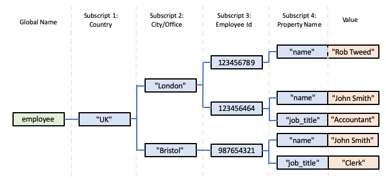

Next, if we do this:

        KILL employee["UK", "London", 123456789, "name"]

This again specifies a Leaf Node, so it is deleted along with its value.  However, this time, the parent Intermediate Node specified by its parent subscript (*123456789*) **is** deleted because it now no longer has any Child Nodes.  Again, represented visually:

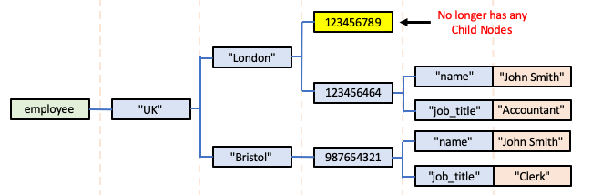

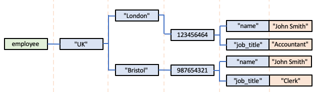

Next, if we do this:

        KILL employee["UK", "London", 123456464]

This specifies an Intermediate Node, so all its Child Nodes are deleted, ie, in our example:

        employee["UK", "London", 123456464, "name"]
        employee["UK", "London", 123456464, "job_title"]

As these are Leaf Nodes, their values are also deleted.

Having deleted these Child Nodes, the Intermediate Node itself is deleted.  However, in doing so, its parent Intermediate Node (ie represented by the subscript value *London*) now no longer has any Child Nodes, so it is also deleted.  

In turn, its parent Intermediate Node (ie represented by the subscript value *UK*) is checked, but in this case it still has a Child Node (represented by the subscript value *Bristol*), so it is **not** deleted.

Summarised visually:

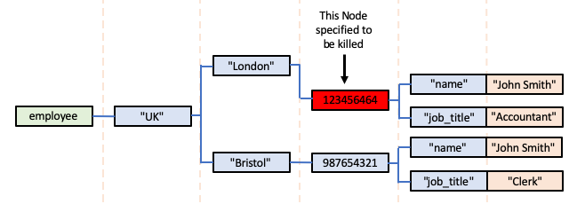

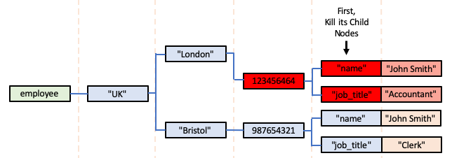

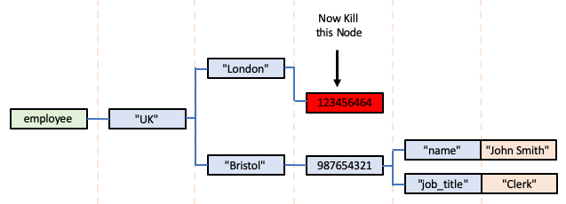

The parent Intermediate Node (*London*) now has no Child Nodes:

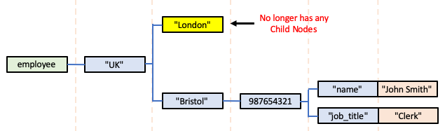

So it is deleted, just leaving these Nodes in the database:

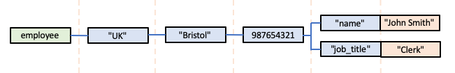

Next, let's Kill this Global Node:

        KILL employee["UK", "Bristol", 987654321, "name"]

That just removes the specified Leaf Node, but its parent Intermediate Node still has a Child Node so it is left in place, leaving us with just this:

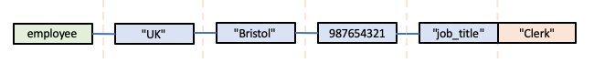

So now let's see what happens if we do this:

        KILL employee["UK", "Bristol"]

The following sequence will occur:

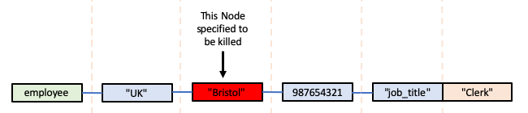

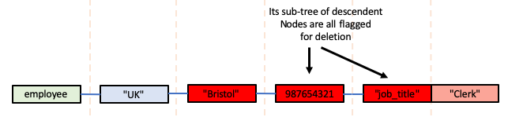

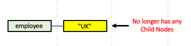

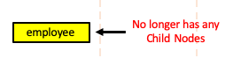

Deletion of this top Global Name node will then remove the *employee* Global from the database.

----

## Data

The *Data* API allows you to determine the existence and/or nature of a Global Node.  You've probably realised by now that such an API is actually extremely valuable, given the potentially ambiguous values that can be returned by the [*Get*](#get) API.

The *Data* API requires 2 arguments:

- Global Name (eg *employee*)
- An array or list of subscripts (eg ["UK", "London", 123456789, "name"])

If the arguments match an existing Leaf Node, then it returns a value of 1.

If the arguments refer to a Global or Global Node that does not exist, it returns a value of 0.

If the arguments match an existing Intermediate Node, then it returns:

- a value of 10 if the Intermediate Node has no value
- a value of 11 if the Intermediate Node has a value.

Of course, following my earlier recommendations, you will normally expect an Intermediate Node to be indicated by a return value of 10.

