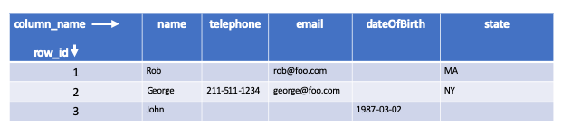
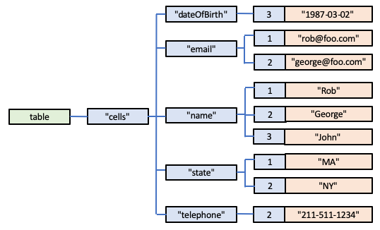

# Implementing a Columnar/Tabular Database using Globals

A basic *sparse* Columnar or Tabular database could be modelled using the following Global structure:

        table["cells", column_name, row_id) = value

Each of the Global Leaf Nodes for this structure would define the value of a particular cell in the two-dimensional table it represented.

For example, this table:

could be represented in Global Storage thus:

        table["cells", "dateOfBirth", 3] = "1987-01-23"
        table["cells", "email", 1] = "rob@foo.com"
        table["cells", "email", 2] = "george@foo.com"
        table["cells", "name", 1] = "Rob"
        table["cells", "name", 2] = "George"
        table["cells", "name", 3] = "John"
        table["cells", "state", 1] = "MA"
        table["cells", "state", 2] = "NY"
        table["cells", "telephone", 2] = "211-555-4121"

or, diagrammatically:

Indices could be added and maintained for each cell value, allowing rapid access by row_id and/or cell value.

For example, to locate all the cells with values for a particular row:

        table["by_row", row_id, columnName] = ""

For the example table above, the following index records would therefore also be stored in Global Storage:

        table["by_row", 1, "email"] = ""
        table["by_row", 1, "name"] = ""
        table["by_row", 1, "state"] = ""
        table["by_row", 2, "email"] = ""
        table["by_row", 2, "name"] = ""
        table["by_row", 2, "state"] = ""
        table["by_row", 2, "telephone"] = ""
        table["by_row", 3, "dateOfBirth"] = ""
        table["by_row", 3, "name"] = ""

So, using this index, we can see that row *2* has values for *email*, *name* and *state*, and knowing that, we can get their values using:

        GET table["cells", "email", 2]
        GET table["cells", "name", 2]
        GET table["cells", "state", 2]

Alternatively, to locate all cells with a particular value in a specific column we might maintain this index:

        table["by_value", columnName, value, row_id] = ""

which, for the table above, could mean storing the following index values in the Global:

        table["by_value", "dateOfBirth", "1987-01-23", 3] = ""
        table["by_value", "email", "rob@foo.com", 1] = ""
        table["by_value", "email", "george@foo.com", 2] = ""
        table["by_value", "name", "George", 2] = ""
        table["by_value", "name", "John", 3] = ""
        table["by_value", "name", "Rob", 1] = ""
        table["by_value", "state", "MA", 1] = ""
        table["by_value", "state", "NY", 2] = ""
        table["by_value", "telephone", "211-555-4121", 2] = ""

So, from this index, I can see that there is one record in the table that has a *state* of *NY*, and that is *row* 2.  So, knowing this I could retrieve all the cells for this row by next using the *by_row* index for *row* 2.

Of course, you aren't restricted to such indices: Global Storage provides you with the freedom to design and maintain whatever data structures best meet your needs.

