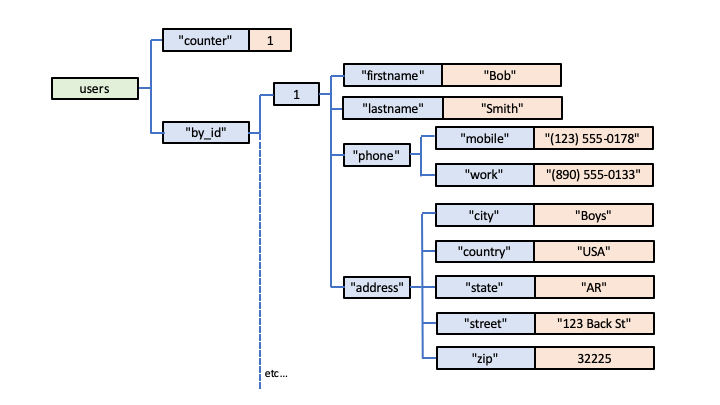

# Implementing a Document Database using Globals

Most Document Databases are designed around the concept of storing and maintaining data structured according to the JavaScript Object Notation (JSON).

Global Storage can be used very simply to provide highly functional Document Storage: there is a direct, one-to-one correspondence between 
[JSON and Global Storage](./Global_Storage.md#global-storage-is-actually-just-like-json).

In summary, each property in a JSON document can be represented as a corresponding subscript in a Global Node.

So, a very simple document with one property:

        {"key": "value"}

could be represented in Global Storage as:

        document["key"] = "value"

A more complex document with a deeper hierarchy:

        {"key1": {"key2": {"key3": "value"}}}

could be represented in Global Storage as:

        document["key1", "key2", "key3"] = "value"

So, for example, consider this JSON-structured Document:

        {
          "firsname": "Bob",
          "lastname": "Smith",
          "phone": {
            "mobile": "(123) 555-0178",
            "work": "(890) 555-0133"
          }
          "address": {
            "street": "123 Back St",
            "city": "Boys",
            "state": "AR"
            "zip": 32225
            "country": "USA"
          }
        }

This could therefore be mapped directly to a corresponding Global Structure:

        document["firstname"] = "Bob"
        document["lastname"] = "Smith"
        document["phone", "mobile"] = "(123) 555-0178"
        document["phone", "work"] = "(890) 555-0133"
        document["address", "street"] = "123 Back St"
        document["address", "city"] = "Boys"
        document["address", "state"] = "AR"
        document["address", "zip"] = 32225
        document["address", "country"] = "USA"

Of course, to create a collection of such documents, it would be sensible to extend the Global Subscripting to allow each member document to have a unique Id, eg:

        users["by_id", 1, "firstname"] = "Bob"
        users["by_id", 1, "lastname"] = "Smith"
        users["by_id", 1, "phone", "mobile"] = "(123) 555-0178"
        users["by_id", 1, "phone", "work"] = "(890) 555-0133"
        users["by_id", 1, "address", "street"] = "123 Back St"
        users["by_id", 1, "address", "city"] = "Boys"
        users["by_id", 1, "address", "state"] = "AR"
        users["by_id", 1, "address", "zip"] = 32225
        users["by_id", 1, "address", "country"] = "USA"

and add a counter Node for allocating the Ids (by *Increment*ing it):

        users["counter"] = 1

Diagrammatically, this Global Storage could be visualised as follows:

## Saving JSON Data

To save a JSON Document, an API would need to be designed to recursively traverse all its properties, and use these to invoke a corresponding Global *Set* API to same each property, eg:

- from this level of the JSON document

        document.address.city  // value = "Boys"

- invoke this:

        set users["by_id", 1, "address", "city"] = "Boys"

## Retrieving JSON Data

An API could easily be designed using the [*Query* API](./Leaf_Nodes.md#the-query-api) to traverse a member's Leaf Nodes to return the data as a corresponding JSON structure.

## Much More than a Simple Document Database

In most Document Databases, the "unit of storage" is the entire Document, often actually stored as a *blob*.  To modify a value within a document, you usually therefore have to fetch the document as and in-memory JSON, modify the value within the JSON and then save the entire modified document back into the database.

With a Global Storage representation as shown above, the "unit of storage" becomes much more fine-grained: each individual key/value pair within the document.  So you can access and modify any value, anywhere within a document, no matter how large or complex, directly *in-situ* within the database itself, without the need for a round-trip of the entire document in and out of local memory.

You could, of course, extend your Global Storage data modelling to include whatever degree of 
[indexing](./Indexing.md) you required to allow fast querying of the documents, eg: to allow you to get immediate answers to questions such as "Find me all the documents for users in Albany, New York".

# QEWD-JSdb

We've applied modelling similar to that described above to do something unique and extremely powerful: extend Node.js to provide persistent JavaScript Objects and Document Storage.  This is available as an Open Source project known as 
[QEWD-JSdb](https://github.com/robtweed/qewd-jsdb).  

There's a 
[detailed tutorial](https://github.com/robtweed/qewd-jsdb/blob/master/REPL.md) for QEWD-JSdb, where the
[APIs for saving and retrieving JSON documents](https://github.com/robtweed/qewd-jsdb/blob/master/REPL.md#saving-json-in-a-document-node)
 (*setDocument()* and *getDocument()*) are described.

QEWD-JSdb can be used with any Global Storage implementation.

For an introduction to QEWD-JSdb and its underlying concept, watch 
[this video](https://www.youtube.com/watch?v=1TlAKTw167s)

