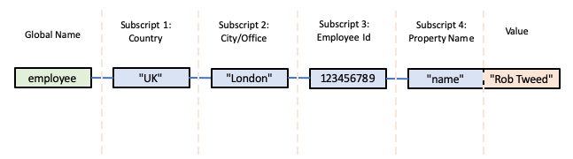
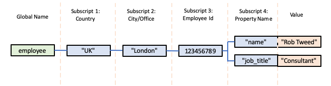
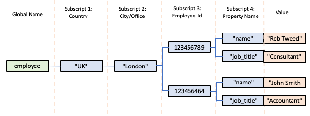
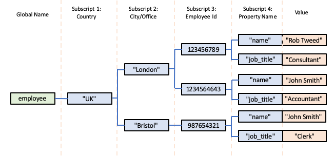
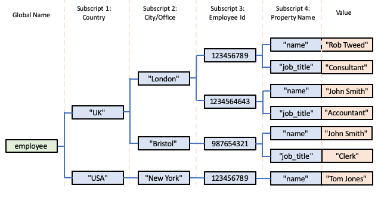
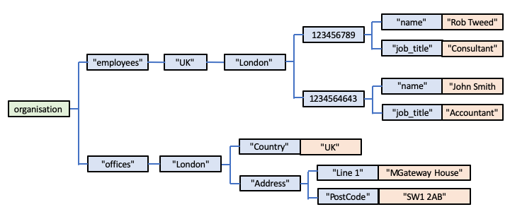

# Global Storage Databases?

It is most likely that you've never heard of a *Global Storage Database*.  They are a pretty 
well-hidden treasure amongst database technologies and architectures, but that is not because
they are inferior in any way, or a technology that you should continue to ignore.

Global Storage Databases are highly functional.  Pretty much any database model/abstraction - 
relational, graph, key/value, tabular, document or XML/DOM - can be implemented with Global Storage.

Global Storage Databases are also incredibly quick and simple to use: if you know how to create and use in-memory
data structures in your favourite language using, for example, associative arrays or JSON, then
there's very little more than that involved in using on-disk Global Storage instead.

They can also be incredibly fast.  In fact, our recent experiments have shown that the main
"native" Global Storage databases are the fastest databases in the marketplace, and by a significant margin.

So if you thought you knew everything there was to know about databases, but have never heard of
Global Storage databases, you really should take the time to find out more!

----

# So What is a Global Storage Database?

A *Global Storage* database uses a schema-free, multi-dimensional storage architecture.  If you are familiar with 
[PHP's multi-dimensional associative arrays](https://www.geeksforgeeks.org/multidimensional-associative-array-in-php/),
 then Global Storage is a very similar concept, but Global Storage arrays exist in persistent database storage rather than in-memory.

Global Storage persistent multi-dimensional arrays are also *sparse*, meaning that only array elements with actual values are stored.  As a result, Global Storage is very efficient in terms of disk utilisation, and no pre-allocation of storage resources are required when you begin to store data in a persistent multi-dimensional array.

There are several available "native" Global Storage
databases.  However, the specification for Global Storage and the associated APIs needed to provide access to a Global Storage database are relatively straightforward, so it's also possible to create a Global Storage abstraction on top of other databases, provided they allow the implementation of some very specific features.  Typically, this means that most databases that are, themselves, hierarchical and use an underlying *b-tree* engine are potential candidates for layering a Global Storage abstraction on top.  However, additionally, Redis - typically assumed to be a fairly simple (but very fast) key/value store - turns out to also be a candidate, due to one of its unique APIs. For more information, see the separate, detailed document on 
[Global Storage Implementations](./Implementations.md).

----

# How is Data Represented in Global Storage?

A collection of data is represented as multi-dimensional array elements.  Each array element is
known as a *Global Node*.  A Global Node has:

- an array name: basically the name of the array or document to which the element belongs.  In Global Storage parlance, this is known as a *Global* (an abbreviation of the term *Global Persistent Variable*).

- typically one or more *subscripts*, where each subscript defines the value of the dimension it represents.  A Global Node can actually be defined without any subscripts, but this is fairly unusual and not particularly useful.  Subscript values can be text or numeric (integer or floating point) values.  However, empty string values are not allowed.  In theory there is no limit to the number of subscripts allowed for a Global Node, but, in practice, there is often an implementation limit.  In fact, for practical reasons, you're probably unlikely to use more than about 4 or 5 subscripts anyway.

- a value.  Global Node values can be text or numeric (integer or floating point) values.  Empty string values are allowed.

So, you can consider a Global Node to be represented as follows:

        global_name(subscript_1 [..., subscript_n]) = value

For example:

        employee("UK", "London", 123456789, "name") = "Rob Tweed"

which might represent: the name of the UK-based employee, working in the London office and with an employee Id of 123456789 is "Rob Tweed".

There are a variety of conventions for denoting Global Nodes, *eg* you might see the same Node above represented as:

        ^employee("UK", "London", 123456789, "name") = "Rob Tweed"

where the ^ denotes that this is a persistent Global Node rather than an in-memory array element.

or, using square brackets instead:

        employee["UK", "London", 123456789, "name"] = "Rob Tweed"

So, in the example above, we're using 4 dimensions that respectively represent

- country
- city (within that country)
- employee Id (within that city)
- property (for the specific employee)

However, it's up to you, the user or database designer, to determine what each dimension represents within your individual Globals.  You can define as many Global Names as you wish, and the subscripts in each of your named Globals can represent entirely different things.

There is no explicit schema for Globals, so the semantic meaning of each subscript within a particular Global is normally implicitly defined in your application logic that makes use of your Global(s).

Some Global Storage users feel that such a completely free-form usage of data within a database is too liberal and maybe even dangerous, and create their own schemas - for which they use Global Storage itself.  However, this is an entirely optional thing to do, and it's up to you to decide what, if anything, your requirements are beyond simple storage in Global Nodes.

----

# Visualising Global Storage

So, within an individual named Global, a hierarchical tree of Global Nodes will be created, representing all the members of that Global.

It can be helpful to visualise what the storage looks like.  We'll start with the Global Node above:

In this visualisation, the Global Name is shown in a green box, the subscript values are in blue boxes, and the value is shown in an orange box.  For clarity, the semantic meaning of each subscript is also shown in the headings.

Let's add another property - job title - to this employee's data:

        employee["UK", "London", 123456789, "job_title"] = "Consultant"

The hierarchical tree of Global Nodes would now look like this:

Next, we'll add another employee to the London Office:

        employee["UK", "London", 123456464, "name"] = "John Smith"
        employee["UK", "London", 123456464, "job_title"] = "Accountant"

We're specifying a different value for the third subscript, denoting this employee's Id, but the first two subscripts are the same: UK and London.

Now the hierarchical tree of Global Nodes would look like this:

Next, we'll add another employee, but this time for an office in Bristol:

        employee["UK", "Bristol", 987654321, "name"] = "John Smith"
        employee["UK", "Bristol", 987654321, "job_title"] = "Clerk"

Notice that although we've already recorded an employee named John Smith at the London Office, this John Smith is a different person, working at the Bristol office in a different role.

So now the hierarchical tree of Global Nodes would look like this:

Of course we could also add an employee at an office in another country, for example:

        employee["USA", "New York", 123456789, "name"] = "Tom Jones"

Notice that the employee Ids in this fictitious example are unique to a particular office in a particular country, so Tom Jones, who works in the New York office in the USA has the same Id as Rob Tweed who works in the London office in the UK.  You can see that the multi-dimensional Global Storage allows this to be unambiguously represented.

Here's what the hierarchical tree of Global Nodes would now look like:

Two important things to understand at this point are that:

- the semantic meaning of each subscript can vary depending on the value of its parent subscript;
- the number of child subscripts can vary depending on their parent subscript values.

In other words, the hierarchical tree of Global Nodes can be completely free-form.  For example, we could design a different Global structure in which we can define not only the employees of our company, but also other properties of the organisation.  For example, it would be quite reasonable to create a structure as shown below:

So, in this Global structure, the first subscript defines a particular property of the organisation, *eg* as shown above:

- employees
- offices

Below the *employees" subscript is the sub-tree of employee record Nodes, as we saw previously, *eg*:

        organisation["employees", "UK", "London", 123456789, "job_title"] = "Consultant"

But the sub-tree of *office* Nodes looks quite different, *eg*:

        organisation["offices", "London", "Country"] = "UK"

Indeed, you'll see that the "Address" property introduces its own sub-tree of Nodes:

        organisation["offices", "London", "Address", "Line 1"] = "MGateway House"
        organisation["offices", "London", "Address", "PostCode"] = "SW1 2AB"

The point is that there is no hard and fast set of rules that are imposed on you: it's up to you how many subscripts you define and what they mean throughout the hierarchical tree of Nodes you create within a specific Global.

----

# Global Storage is Actually Just Like JSON

If what is described above is a little confusing, then consider how this compares with a JSON structure.  JSON also defines a free-form, schema-free hiearchy.  Indeed we could visualise our Global Storage shown above as a corresponding JSON structure instead:

        {
          "employees": {
            "UK": {
              "London": {
                123456789: {
                  "name": "Rob Tweed",
                  "job_title": "Consultant"
                },
                123456464: {
                  "name": "John Smith",
                  "job_title": "Accountant"
                }
              }
            }
          },
          "offices": {
            "London": {
              "Country" "UK",
              "Address": {
                "Line 1": "MGateway House",
                "PostCode": "SW1 2AB"
              }
            }
          }
        }

So, in effect, Global Storage can be considered to be the equivalent of persistent JSON storage.  Just like JSON, you have complete freedom in what properties you define at each level within its hierarchy (cf Global Subscripts) and what each property/subscript means or represents.  Just like in JSON, there's nothing that needs to be pre-declared or pre-defined.  You can arbitrarily invent and add new subscripts to represent and store new concepts and values as you need them, extending the JSON structure as you wish.

----

# Beyond the Basics of Global Storage

There's a bit more detail that you should know about Global Storage beyond the basics described so far.  It's these additional features, all of which are pretty straightforward, that give Global Storage its real power and flexibility.  If you're going to really appreciate and understand what Global Storage makes possible, you should delve deeper and read the following:

- [Global Nodes: Intermediate Nodes and Leaf Nodes](./Global_Nodes.md)
- [The Basic CRUD APIs for Global Storage](./Basic_APIs.md)
- [The Magic of a Global's Subscripts](./Subscripts.md)
- [Traversal of Leaf Nodes in Global Storage](./Leaf_Nodes.md)
- [Creating and Maintaining Indices in Global Storage](./Indexing.md)
- [Catering for Multi-User Access: Locking and Transactions in Global Storage](./Multi_User_Access.md)

