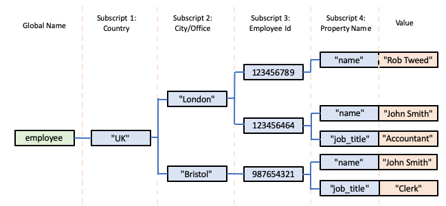
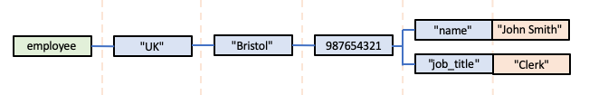
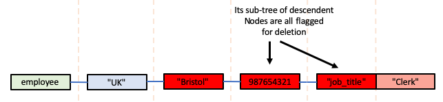
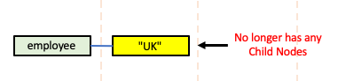

# Global Storage Databases?

It is most likely that you've never heard of a *Global Storage Database*.  They are a pretty 
well-hidden treasure amongst database technologies and architectures, but that is not because
they are inferior in any way, or a technology that you should continue to ignore.

Global Storage Databases are highly functional.  Pretty much any database model/abstraction - 
relational, graph, key/value, tabular, document or XML/DOM - can be implemented with Global Storage.

Global Storage Databases are also incredibly quick and simple to use: if you know how to create and use in-memory
data structures in your favourite language using, for example, associative arrays or JSON, then
there's very little more than that involved in using on-disk Global Storage instead.

They can also be incredibly fast.  In fact, our recent experiments have shown that the main
"native" Global Storage databases are the fastest databases in the marketplace, and by a significant margin.

So if you thought you knew everything there was to know about databases, but have never heard of
Global Storage databases, you really should take the time to find out more!

----

# So What is a Global Storage Database?

A *Global Storage* database uses a schema-free, multi-dimensional storage architecture.  If you are familiar with 
[PHP's multi-dimensional associative arrays](https://www.geeksforgeeks.org/multidimensional-associative-array-in-php/),
 then Global Storage is a very similar concept, but Global Storage arrays exist in persistent database storage rather than in-memory.

Global Storage persistent multi-dimensional arrays are also *sparse*, meaning that only array elements with actual values are stored.  As a result, Global Storage is very efficient in terms of disk utilisation, and no pre-allocation of storage resources are required when you begin to store data in a persistent multi-dimensional array.

There are several available "native" Global Storage
databases.  However, the specification for Global Storage and the associated APIs needed to provide access to a Global Storage database are relatively straightforward, so it's also possible to create a Global Storage abstraction on top of other databases, provided they allow the implementation of some very specific features.  Typically, this means that most databases that are, themselves, hierarchical and use an underlying *b-tree* engine are potential candidates for layering a Global Storage abstraction on top.  However, additionally, Redis - typically assumed to be a fairly simple (but very fast) key/value store - turns out to also be a candidate, due to one of its unique APIs. For more information, see the separate, detailed document on 
[Global Storage Implementations](./Implementations.md).

----

# How is Data Represented in Global Storage?

A collection of data is represented as multi-dimensional array elements.  Each array element is
known as a *Global Node*.  A Global Node has:

- an array name: basically the name of the array or document to which the element belongs.  In Global Storage parlance, this is known as a *Global* (an abbreviation of the term *Global Persistent Variable*).

- typically one or more *subscripts*, where each subscript defines the value of the dimension it represents.  A Global Node can actually be defined without any subscripts, but this is fairly unusual and not particularly useful.  Subscript values can be text or numeric (integer or floating point) values.  However, empty string values are not allowed.  In theory there is no limit to the number of subscripts allowed for a Global Node, but, in practice, there is often an implementation limit.  In fact, for practical reasons, you're probably unlikely to use more than about 4 or 5 subscripts anyway.

- a value.  Global Node values can be text or numeric (integer or floating point) values.  Empty string values are allowed.

So, you can consider a Global Node to be represented as follows:

        global_name(subscript_1 [..., subscript_n]) = value

For example:

        employee("UK", "London", 123456789, "name") = "Rob Tweed"

which might represent: the name of the UK-based employee, working in the London office and with an employee Id of 123456789 is "Rob Tweed".

There are a variety of conventions for denoting Global Nodes, *eg* you might see the same Node above represented as:

        ^employee("UK", "London", 123456789, "name") = "Rob Tweed"

where the ^ denotes that this is a persistent Global Node rather than an in-memory array element.

or, using square brackets instead:

        employee["UK", "London", 123456789, "name"] = "Rob Tweed"

So, in the example above, we're using 4 dimensions that respectively represent

- country
- city (within that country)
- employee Id (within that city)
- property (for the specific employee)

However, it's up to you, the user or database designer, to determine what each dimension represents within your individual Globals.  You can define as many Global Names as you wish, and the subscripts in each of your named Globals can represent entirely different things.

There is no explicit schema for Globals, so the semantic meaning of each subscript within a particular Global is normally implicitly defined in your application logic that makes use of your Global(s).

Some Global Storage users feel that such a completely free-form usage of data within a database is too liberal and maybe even dangerous, and create their own schemas - for which they use Global Storage itself.  However, this is an entirely optional thing to do, and it's up to you to decide what, if anything, your requirements are beyond simple storage in Global Nodes.

----

# Visualising Global Storage

So, within an individual named Global, a hierarchical tree of Global Nodes will be created, representing all the members of that Global.

It can be helpful to visualise what the storage looks like.  We'll start with the Global Node above:

In this visualisation, the Global Name is shown in a green box, the subscript values are in blue boxes, and the value is shown in an orange box.  For clarity, the semantic meaning of each subscript is also shown in the headings.

Let's add another property - job title - to this employee's data:

        employee["UK", "London", 123456789, "job_title"] = "Consultant"

The hierarchical tree of Global Nodes would now look like this:

Next, we'll add another employee to the London Office:

        employee["UK", "London", 123456464, "name"] = "John Smith"
        employee["UK", "London", 123456464, "job_title"] = "Accountant"

We're specifying a different value for the third subscript, denoting this employee's Id, but the first two subscripts are the same: UK and London.

Now the hierarchical tree of Global Nodes would look like this:

Next, we'll add another employee, but this time for an office in Bristol:

        employee["UK", "Bristol", 987654321, "name"] = "John Smith"
        employee["UK", "Bristol", 987654321, "job_title"] = "Clerk"

Notice that although we've already recorded an employee named John Smith at the London Office, this John Smith is a different person, working at the Bristol office in a different role.

So now the hierarchical tree of Global Nodes would look like this:

Of course we could also add an employee at an office in another country, for example:

        employee["USA", "New York", 123456789, "name"] = "Tom Jones"

Notice that the employee Ids in this fictitious example are unique to a particular office in a particular country, so Tom Jones, who works in the New York office in the USA has the same Id as Rob Tweed who works in the London office in the UK.  You can see that the multi-dimensional Global Storage allows this to be unambiguously represented.

Here's what the hierarchical tree of Global Nodes would now look like:

Two important things to understand at this point are that:

- the semantic meaning of each subscript can vary depending on the value of its parent subscript;
- the number of child subscripts can vary depending on their parent subscript values.

In other words, the hierarchical tree of Global Nodes can be completely free-form.  For example, we could design a different Global structure in which we can define not only the employees of our company, but also other properties of the organisation.  For example, it would be quite reasonable to create a structure as shown below:

So, in this Global structure, the first subscript defines a particular property of the organisation, *eg* as shown above:

- employees
- offices

Below the *employees" subscript is the sub-tree of employee record Nodes, as we saw previously, *eg*:

        organisation["employees", "UK", "London", 123456789, "job_title"] = "Consultant"

But the sub-tree of *office* Nodes looks quite different, *eg*:

        organisation["offices", "London", "Country"] = "UK"

Indeed, you'll see that the "Address" property introduces its own sub-tree of Nodes:

        organisation["offices", "London", "Address", "Line 1"] = "MGateway House"
        organisation["offices", "London", "Address", "PostCode"] = "SW1 2AB"

The point is that there is no hard and fast set of rules that are imposed on you: it's up to you how many subscripts you define and what they mean throughout the hierarchical tree of Nodes you create within a specific Global.

----

# Global Storage is Actually Just Like JSON

If what is described above is a little confusing, then consider how this compares with a JSON structure.  JSON also defines a free-form, schema-free hiearchy.  Indeed we could visualise our Global Storage shown above as a corresponding JSON structure instead:

        {
          "employees": {
            "UK": {
              "London": {
                123456789: {
                  "name": "Rob Tweed",
                  "job_title": "Consultant"
                },
                123456464: {
                  "name": "John Smith",
                  "job_title": "Accountant"
                }
              }
            }
          },
          "offices": {
            "London": {
              "Country" "UK",
              "Address": {
                "Line 1": "MGateway House",
                "PostCode": "SW1 2AB"
              }
            }
          }
        }

So, in effect, Global Storage can be considered to be the equivalent of persistent JSON storage.  Just like JSON, you have complete freedom in what properties you define at each level within its hierarchy (cf Global Subscripts) and what each property/subscript means or represents.  Just like in JSON, there's nothing that needs to be pre-declared or pre-defined.  You can arbitrarily invent and add new subscripts to represent and store new concepts and values as you need them, extending the JSON structure as you wish.

----

# Intermediate and Leaf Nodes in a Global

So far we've really only focused on Global Nodes that hold data, *eg*:

        employee["UK", "London", 123456789, "name"] = "Rob Tweed"

However, in a Global Storage Database, each one of the levels within the hierarchy represented by this Node's subscripts is also accessible as a Global Node, *ie* for the example above, the following Global Nodes also exist and can be accessed:

        employee["UK", "London", 123456789]
        employee["UK", "London"]
        employee["UK"]

These nodes, which do not, themselves, have a data value, but which have one or more Child Nodes beneath them, are known as *Intermediate Nodes*.  To clarify what I mean by *Child Nodes*, in the simple example above:

        employee["UK"]  

has 1 Child Node, represented by the additional subscript value *London*

        employee["UK", "London"]  

has 1 Child Node, represented by the additional subscript value *123456789*

        employee["UK", "London", 123456789] 

has 1 Child Node, represented by the additional subscript value *name*

If we added this Leaf Node:

        employee["UK", "London", 123456789, "job_title"] = "Consultant"

then:

        employee["UK", "London", 123456789] 

now has 2 Child Nodes, represented by the additional subscript values *name* and *job_title*.

Global Nodes that hold a data value and have no Child Nodes are known as *Leaf Nodes*. *ie* in our example:

        employee["UK", "London", 123456789, "name"]
        employee["UK", "London", 123456789, "job_title"]

are Leaf Nodes

## Intermediate Nodes Can Have A Data Value

One somewhat unusual feature of Global Storage is that, unlike JSON, an Intermediate Node can actually hold a data value if required.  Personally I don't like this capability and tend not to make use of it, but you should be aware that it exists and you can make use of it if you wish.  You also need to be aware of this feature in order to fully understand one of the Global Storage APIs that we'll discuss later: the *data* API.

To summarise, the following would be legitimate in Global Storage:

        employee["UK"] = 10                                         Intermediate Node with value
        employee["UK", "London"] = 21                               Intermediate Node with value
        employee["UK", "London", 123456789]                         Intermediate Node without value
        employee["UK", "London", 123456789, "name"] = "Rob Tweed"   Leaf Node

Note that a Leaf Node **must** have a value, by definition.

However, I'd recommend not giving values to Intermediate Nodes. *ie* this would be a more usual scenario:

        employee["UK"]                                              Intermediate Node without value
        employee["UK", "London"]                                    Intermediate Node without value
        employee["UK", "London", 123456789]                         Intermediate Node without value
        employee["UK", "London", 123456789, "name"] = "Rob Tweed"   Leaf Node

----

# The Basic CRUD APIs for Global Storage

The basic, fundamental APIs for creating, reading, editing and deleting Global Nodes are as follows:

- [Set](#set)
- [Get](#get)
- [Kill or Delete](#kill-or-delete)
- [Data](#data)

## Set

The *Set* API is used to create and modify a Global Node.  It requires 3 arguments:

- Global Name (eg *employee*)
- An array or list of subscripts (eg ["UK", "London", 123456789, "name"])
- A value (eg "Rob Tweed")

### Effect of the *Set* API On Intermediate Nodes

Intermediate Nodes are created automatically, if they don't already exist.  There is no API to create an Intermediate Node, since Global Storage is *sparse*.

In other words, using the *Set* API to create the Node:

        SET employee["UK", "London", 123456789, "name"] = "Rob Tweed"

also automatically creates the Intermediate Nodes:

        employee["UK"]
        employee["UK", "London"]
        employee["UK", "London", 123456789]

If we then use the *Set* API to create the Node:

        SET employee["UK", "London", 123456789, "job_title"] = "Consultant"

all its Intermediate Nodes already exist, so only the Leaf Node is created.

However, if we then create the Node:

        SET employee["UK", "London", 123456464, "name"] = "John Smith"

then this Intermediate Node will also be created:

        employee["UK", "London", 123456464]

### Editing Global Node Values

If the Global Node specified by the *Set* API's Global Name and Subscripts arguments already exists, then its value will be changed to the new value specified in the *Set* API, eg if we do this:

        SET employee["UK", "London", 123456789, "job_title"] = "Software Developer"

then the previous value for this Global Node (*Consultant*) will be immediately changed to *Software Developer*.

Of course, changing the value of a Global Node will have no effect on its Intermediate Nodes.

## Get

The *Get* API returns the value, if any, of a Global Node.  It requires 2 arguments:

- Global Name (eg *employee*)
- An array or list of subscripts (eg ["UK", "London", 123456789, "name"])

If the arguments match an existing Leaf Node, then its value is returned.

If the arguments match an Intermediate Node, an empty string value is returned.

If the arguments match a Global Node that does not actually exist, an empty string value is returned.

## Kill or Delete

The *Kill* or *Delete* API deletes a Global Node **and any child nodes below it**.

It requires 2 arguments:

- Global Name (eg *employee*)
- An array or list of subscripts (eg ["UK", "London", 123456789, "name"])

If the arguments match an existing Leaf Node, then it is deleted.  If, as a result of the Leaf Node being deleted, any of its Intermediate Nodes no longer have any Child Nodes, then the Intermediate Node is also deleted.  This is part of the *sparse* nature of Global Storage.

If the arguments match an Intermediate Node, then it and all its Child Nodes (and recursively their Child Nodes) are deleted.

If the arguments match a Global Node that does not actually exist, the *Kill* or *Delete* is ignored and nothing happens.

If no subscripts are specified, and the Global Name exists, then its entire tree of Global Nodes is deleted and the Global no longer exists in the database.

**Note: The *Kill* or *Delete* API must be used with great care.  Its effects are immediate, permanent and unrecoverable (unless you have a backup of the database).**

The behaviour of the *Kill* or *Delete* on Intermediate Nodes and Child Nodes is important to understand, and probably best illustrated using a couple of examples.  Suppose we have the following Global Nodes defined:

        employee["UK", "London", 123456789, "name"] = "Rob Tweed"
        employee["UK", "London", 123456789, "job_title"] = "Consultant"
        employee["UK", "London", 123456464, "name"] = "John Smith"
        employee["UK", "London", 123456464, "job_title"] = "Accountant"
        employee["UK", "Bristol", 987654321, "name"] = "John Smith"
        employee["UK", "Bristol", 987654321, "job_title"] = "Clerk"

So the "tree" of Global Nodes would be as shown below:

If we now do the following:

        KILL employee["UK", "London", 123456789, "job_title"]

This specifies a Leaf Node, so it is deleted along with its value.  The parent Intermediate Node specified by its parent subscript (*123456789*) is **not** deleted, because it still has a Child Node specified by the subscript *name*.  This is most easily understood if we visualise what the tree of Global Nodes would now look like following this *Kill*:

Next, if we do this:

        KILL employee["UK", "London", 123456789, "name"]

This again specifies a Leaf Node, so it is deleted along with its value.  However, this time, the parent Intermediate Node specified by its parent subscript (*123456789*) **is** deleted because it now no longer has any Child Nodes.  Again, represented visually:

Next, if we do this:

        KILL employee["UK", "London", 123456464]

This specifies an Intermediate Node, so all its Child Nodes are deleted, ie, in our example:

        employee["UK", "London", 123456464, "name"]
        employee["UK", "London", 123456464, "job_title"]

As these are Leaf Nodes, their values are also deleted.

Having deleted these Child Nodes, the Intermediate Node itself is deleted.  However, in doing so, its parent Intermediate Node (ie represented by the subscript value *London*) now no longer has any Child Nodes, so it is also deleted.  

In turn, its parent Intermediate Node (ie represented by the subscript value *UK*) is checked, but in this case it still has a Child Node (represented by the subscript value *Bristol*), so it is **not** deleted.

Summarised visually:

The parent Intermediate Node (*London*) now has no Child Nodes:

So it is deleted, just leaving these Nodes in the database:

Next, let's Kill this Global Node:

        KILL employee["UK", "Bristol", 987654321, "name"]

That just removes the specified Leaf Node, but its parent Intermediate Node still has a Child Node so it is left in place, leaving us with just this:

So now let's see what happens if we do this:

        KILL employee["UK", "Bristol"]

The following sequence will occur:

Deletion of this top Global Name node will then remove the *employee* Global from the database.

## Data

The *Data* API allows you to determine the existence and/or nature of a Global Node.  You've probably realised by now that such an API is actually extremely valuable, given the potentially ambiguous values that can be returned by the [*Get*](#get) API.

The *Data* API requires 2 arguments:

- Global Name (eg *employee*)
- An array or list of subscripts (eg ["UK", "London", 123456789, "name"])

If the arguments match an existing Leaf Node, then it returns a value of 1.

If the arguments refer to a Global or Global Node that does not exist, it returns a value of 0.

If the arguments match an existing Intermediate Node, then it returns:

- a value of 10 if the Intermediate Node has no value
- a value of 11 if the Intermediate Node has a value.

Of course, following my earlier recommendations, you will normally expect an Intermediate Node to be indicated by a return value of 10.

----

# The Magic of A Global's Subscripts

The subscripts of a Global have two absolutely key features that arguably give Global Storage its true power and flexibility:

- automatic alphanumeric collation
- built-in pointers to a subscript's previous and next sibling subscripts.

## Alphanumeric Collation of Subscripts

A deceptively simple, yet incredibly powerful characteristic of a Global's subscripts is that they are automatically collated in ASCII (ie alphanumeric) sequence.  This happens automatically when you use either the [*Set*](#set) or [*Kill*](#kill-or-delete) APIs:

- when you add/create a new Global Node, each of its subscripts is automatically collated in alphanumeric sequence with respect to its peers.

- when you delete a Global Node, any remaining peer subscripts are automatically re-ordered.

Let's see that collation mechanism in practice via an example.  Suppose we start by invoking:

        SET employee["UK", "London", 123456789, "name"] = "Rob Tweed"

If this is the first Node in the *employee* Global, then the Leaf Node with its associated value is created, along with its Intermediate Nodes.

So what happens when we next invoke:

        SET employee["UK", "London", 123456789, "job_title"] = "Consultant"

The Intermediate Node:

        employee["UK", "London", 123456789]

now has two Child Nodes, with subscripts of *name* and *job_title*.  But because *job_title* is, in alphanumeric collation terms before *name*, *job_title* automatically becomes the first subscript.  In other words, in terms of Global Storage, we now have:

        employee["UK", "London", 123456789, "job_title"] = "Consultant"
        employee["UK", "London", 123456789, "name"] = "Rob Tweed"

If we were to now invoke:

        SET employee["UK", "London", 123456789, "key_holder"] = 1

this would be automatically inserted between the two existing Nodes:

        employee["UK", "London", 123456789, "job_title"] = "Consultant"
        employee["UK", "London", 123456789, "key_holder"] = 1
        employee["UK", "London", 123456789, "name"] = "Rob Tweed"

Of course, if that newly inserted Node was *Kill*ed:

        KILL employee["UK", "London", 123456789, "key_holder"]

then the remaining subscripts automatically re-order themselves:

        employee["UK", "London", 123456789, "job_title"] = "Consultant"
        employee["UK", "London", 123456789, "name"] = "Rob Tweed"

This automatic collation occurs at all subscripting levels, so if we now invoke:

        SET employee["UK", "London", 123456464, "name"] = "John Smith"

then the third subscript - ie the child subscript of the *London* subscript - will be automatically collated with respect to other existing child subscripts of *London*.  In other words, the stored Nodes will look like this:

        employee["UK", "London", 123456464, "name"] = "John Smith"
        employee["UK", "London", 123456789, "job_title"] = "Consultant"
        employee["UK", "London", 123456789, "name"] = "Rob Tweed"

The collation is based on the alphanumeric value, and in this case the two subscript values are integers, with 123456464 sorting before the larger integer 123456789.

and of course, invoking this:

        SET employee["UK", "London", 123456464, "job_title"] = "Accountant"

will be collated as shown:

        employee["UK", "London", 123456464, "job_title"] = "Accountant"
        employee["UK", "London", 123456464, "name"] = "John Smith"
        employee["UK", "London", 123456789, "job_title"] = "Consultant"
        employee["UK", "London", 123456789, "name"] = "Rob Tweed"

Note that the collation of subscripts is with respect to their parent subscript, so the "job_title" and "name" subscripts are collated separately for the *123456464* and *123456789* parent subscripts.  It may help to represent these nodes visually to clarify this point:

Hopefully you can see why invoking the following two commands:

        SET employee["UK", Bristol", 987654321, "name"] = "John Smith"
        SET employee["USA", "Albany", 100011111, "name"] = "Tom Jones"

will result in the following collation:

        employee["UK", Bristol", 987654321, "name"] = "John Smith"
        employee["UK", "London", 123456464, "job_title"] = "Accountant"
        employee["UK", "London", 123456464, "name"] = "John Smith"
        employee["UK", "London", 123456789, "job_title"] = "Consultant"
        employee["UK", "London", 123456789, "name"] = "Rob Tweed"
        employee["USA", Albany", 100011111, "name"] = "Tom Jones"

or, represented visually:

## Subscript Peer Pointers

When a Global subscript value is saved, pointers are created between the new subscript and its previous and next peer or sibling subscripts.  Of course, as each new subscript is inserted in the correct collation sequence, any pre-existing pointers for its new previous and next sibling subscripts are also automatically adjusted.

So what this means is that if you know the value of a particular subscript, you can get the values of either its next or previous sibling subscript very efficiently.

So, for example, if we take this Intermediate Node:

        employee["UK", "London", 123456464]

the subscript *123456464* points to its next sibling subscript which is *123456789*.  Of course, in this example, the subscript *123456464* does not have a previous sibling subscript, and the subscript *123456789* does not have a next sibling subscript.

Similarly, in the Intermediate Node:

        employee["UK", "London", 123456464, "job_title"]

we can get to the next sibling subscript of *job_title* via its pointer which is to *name*.

## The *Next* and *Previous* APIs

As a consequence of this automatic subscript collation and a subscript's previous- and next-sibling pointers, Global Storage provides two APIs that really are the key to its power:

- *Next*
- *Previous*

### Next

The *Next* API requires 3 arguments:

- Global Name (eg *employee*)
- An array or list of subscripts (eg ["UK", "London", 123456789, "name"])
- A *seed value*

For example:

        NEXT employee["UK","London"], 123456464

The API will return the value of the child subscript that follows the specified seed value for the specified parent Intermediate Node.

In effect what this API will do is first append the seed value to the array of subscripts and try to find a corresponding Intermediate Node, ie in this case:

        employee["UK", "London", 123456464]

In this example it exists, so it then gets and returns the next sibling subscript pointer, which will be 123456789.

If the seed value doesn't match an actual existing subscript value, then it will find the first existing subscript value that follows the seed value in collation sequence.  In other words:

        NEXT employee["UK","London"], 123456700

will look for the next sibling subscript that would have followed

        employee["UK", "London", 123456700]

if such an Intermediate Node existed (which of course it doesn't in our example).  Once again, however, the value 123456789 will be returned.

If the seed value is an empty string, ie:

        NEXT employee["UK","London"], ""

then what is returned is the value of the first child subscript (in collation sequence), which, in our example will be 123456464.

If the seed value matches the last subscript in collating sequence, or specifies a value that would have collated after the last existing subscript, then an empty string is returned.  So, in our example, an empty string is returned in response to the following two examples:

        NEXT employee["UK","London"], 123456789

        NEXT employee["UK","London"], 876543219

Typically the *Next* API is used within an iteration loop to return either all or a subset of the child subscripts below a specified Intermediate Node.  To return all the subscripts (in alphanumeric collation sequence), the loop is seeded with an empty string, so the first *Next* API invocation returns the value of the first subscript.  This value is then used as the seed value for the next iteration of the loop, which, of course, will return the second subscript value (if it exists).  The loop iterations will then continue returning each successive subscript value until it reaches the last subscript value which, when used as the seed value for the *Next* API, will return an empty string, indicating that all the subscripts have been found and returned.

To return a subset of the existing subscript values, a suitable seed value is provided as the starting point, and the iterations cease once a subscript value is returned that would match or alphanumerically follow a specified termination value.

### Previous

The *Previous* API behaves identically to the *Next* API, except that the subscript value traversal is reversed.  

The *Previous* API requires the same 3 arguments as the *Next* API:

- Global Name (eg *employee*)
- An array or list of subscripts (eg ["UK", "London", 123456789, "name"])
- A *seed value*

However, the subscript previous sibling pointers are used to return the result.

----

# Traversal of Leaf Nodes in Global Storage

There's one final feature of Global Storage that needs to be highlighted.  It's not used as frequently as the *Next* and *Previous* APIs that were described in the previous section, but it can be extremely useful when you need it!

Not only is Global Storage optimised for traversal from one subscript value to its immediate peers, Leaf Nodes are also optimised to point to their previous and next Leaf Nodes.  What constitutes a previous and next Leaf Nodes is determined by the alphanumeric collation of the Global's subscripts, as described previously.

So, having accessed a particular Leaf Node in a Global, you can very efficiently get it its previous and/or next Leaf Node in the Global.  This can allow very rapid traversal through all the data within a Global, or through a sub-section/sub-tree of a Global.

Let's go back to that previous example where we'd created the following records, collated as shown according to their subscript values:

        employee["UK", Bristol", 987654321, "name"] = "John Smith"
        employee["UK", "London", 123456464, "job_title"] = "Accountant"
        employee["UK", "London", 123456464, "name"] = "John Smith"
        employee["UK", "London", 123456789, "job_title"] = "Consultant"
        employee["UK", "London", 123456789, "name"] = "Rob Tweed"
        employee["USA", Albany", 100011111, "name"] = "Tom Jones"

If we have accessed, for example, this Leaf Node:

        employee["UK", "London", 123456464, "name"]

then it has a pointer to its previous Leaf Node:

        employee["UK", "London", 123456464, "job_title"]

and a pointer to its next Leaf Node:

        employee["UK", "London", 123456789, "job_title"]

These Leaf Node pointers are automatically updated behind the scenes whenever a *Set* or *Kill* is invoked.

## The *Query* API

The Global Storage API that makes use of these Leaf Node pointers is named *Query*.

Implementation of the *Query* API can vary, but, in effect, it requires 3 arguments:

- Global Name (eg *employee*)
- An array or list of subscripts (eg ["UK", "London", 123456789, "name"])
- The direction of traversal: ie forwards or backwards, or next/previous

The *Query* API behaves as follows:

- If the Global Name and subscripts specify a Leaf Node that exists in the database, then what is returned is the reference to its previous or next Leaf Node, in the form of its Global Name and its array of subscripts.

- If the Global Name exists in the database, but the subscripts do not actually specify an existing Leaf Node, then what is returned is, in effect, a reference the previous or next Leaf Node for the one specified, *had it actually existed as a Leaf Node*.

- If, instead of an array of subscripts, the subscripts value is an empty string, then what is returned is:
  - a reference to the first Leaf Node of the Global, if the specified direction is *next*
  - a reference to the last Leaf Node of the Global, if the specified direction is *previous*

- If the specified Leaf Node is the first Leaf Node in the Global and the specified direction is *previous*, then an empty string is returned.

- Similarly, if the specified Node is the last Leaf Node in the Global and the specified direction is *next*, then an empty string is returned.

- if the Global Name doesn't exist in the database, an empty string is returned.

Used in an iteration loop, you can see that an empty string value for the subscript can be used to seed the iterations, and a return value of empty string can be used to determine completion of the traversal. 

## Comparison with *Next* and *Previous* APIs for Global Traversal

Leaf Node traversal through a Global can, of course, also be achieved by nesting *Next* APIs to iterate through all the subscripting levels.  However, in the example above, this would require:

- 2 iterations at subscript level 1 (to get *UK* and *USA*)
- 3 iterations at subscript level 2
- 4 iterations at subscript level 3
- 6 iterations at subscript level 4

So a total of 15 iterations to exhaustively traverse the Leaf Nodes of the Global.

By comparison, using the Leaf Node pointers allows traversal of the entire Global in just 6 iterations, a significant difference even in our tiny example Global.

So if what you're interested in is the Leaf Nodes and/or data records in a Global, the *Query* API can be a significantly more efficient means of traversal.

