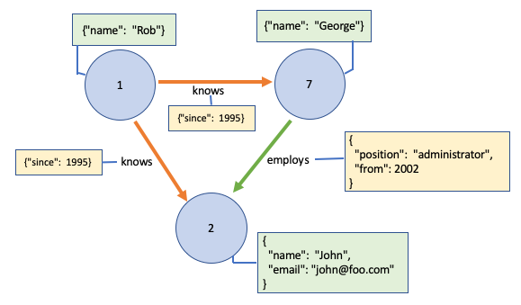
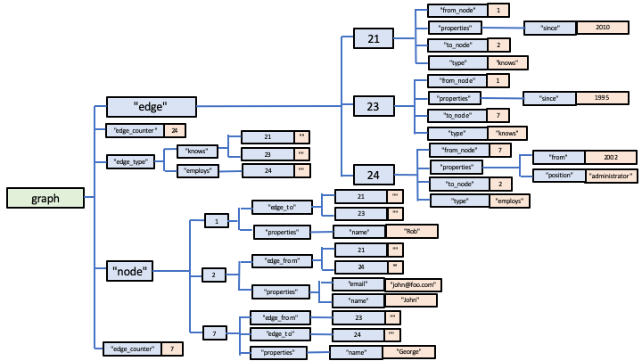

# Implementing a Graph Database using Globals

Graph databases are designed to represent entities (often referred to as *nodes*) and networks of relationships between the entities (often referred to as *edges*).  Both *nodes* and *edges* can have one or more key/value pairs.

The complex part of graph databases is the set of APIs to allow their traversal and querying, but in terms of storage of a graph, it can be implemented fairly straightforwardly.

Take the following example, which would be a common scenario in a social network where graph databases can be particularly useful:

In this example, each node represents a person or user within the system.  Each node/person has a set of properties such as *name*, *email* etc.  Only a few are shown in the example for clarity.  Additionally, *edges* can be defined, representing different types of relationships between the nodes, but each *edge* can have a set of properties.

There are numerous ways in which such a graph could be represented using Global Storage.  Here's my suggestion for a data model:

        graph["node", node_id, "properties", property_name] = value

        graph["node", node_id, "edge_from", edge_id] = ""
        graph["node", node_id, "edge_to", edge_id] = ""

        graph["edge", edge_id, "from_node"] = from_node_id
        graph["edge", edge_id, "to_node"] = to_node_id
        graph["edge", edge_id, "type"] = "knows"
        graph["edge", edge_id, "properties", property_name] = value

        graph["edge_types", "employs", edge_id] = ""
        graph["edge_types", "knows", edge_id] = ""

        graph["edge_counter"] = last_edge_id
        graph["node_counter"] = last_node_id

The graph in the diagram would be represented by such a data model in Global Storage as follows:

        graph["node", 1, "edge_to", 21] = ""
        graph["node", 1, "edge_to", 23] = ""
        graph["node", 1, "properties", "name"] = "Rob"

        graph["node", 2, "edge_from", 21] = ""
        graph["node", 2, "edge_from", 24] = ""
        graph["node", 2, "properties", "email"] = "john@foo.com"
        graph["node", 2, "properties", "name"] = "John"

        graph["node", 7, "edge_from", 23] = ""
        graph["node", 7, "edge_to", 24] = ""
        graph["node", 7, "properties", "name"] = "George"

        graph["edge", 21, "from_node"] = 1
        graph["edge", 21, "properties", "since"] = 2010
        graph["edge", 21, "to_node"] = 2
        graph["edge", 21, "type"] = "knows"

        graph["edge", 23, "from_node"] = 1
        graph["edge", 23, "properties", "since"] = 1995
        graph["edge", 23, "to_node"] = 7
        graph["edge", 23, "type"] = "knows"

        graph["edge", 24, "from_node"] = 7
        graph["edge", 24, "properties", "from"] = 2002
        graph["edge", 24, "properties", "position"] = "administrator"
        graph["edge", 24, "to_node"] = 2
        graph["edge", 24, "type"] = "employs"

        graph["edge_type", "knows", 21] = ""
        graph["edge_type", "knows", 23] = ""
        graph["edge_type", "employs", 24] = ""

        graph["node_counter"] = 7
        graph["edge_counter"] = 24

Note the way that each *node* in the graph records its outgoing and incoming edges, and each *edge* records its start and end *node*., so you could easily traverse from *node* to *node* via the network of *edges".  Each *node* and *edge* can have properties: as many as you like in this model, distinguished by property name, but this could be abstracted further using a set of Global nodes representing allowed properties.

If you needed to find all *edges* of type *employs*, then you can use the *edge_type* index.

Finally, when new nodes or edges are added, the [*Increment* API](./Indexing.md#the-increment-api)
 is applied to the "node_counter* or *edge_counter* value respectively.

Here's the Global Nodes above represented graphically:

As ever, I've just provided one suggestion for modelling a simple graph.  The beauty of Global Storage is you can extend and/or adapt these ideas, and add whatever capabilities you need.

