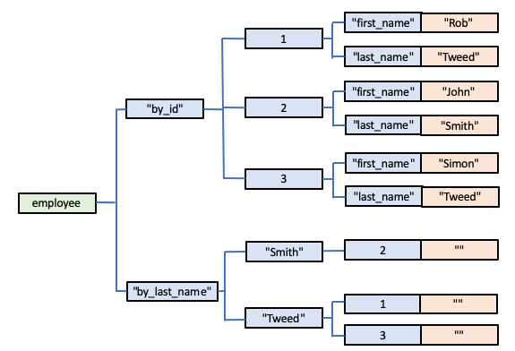
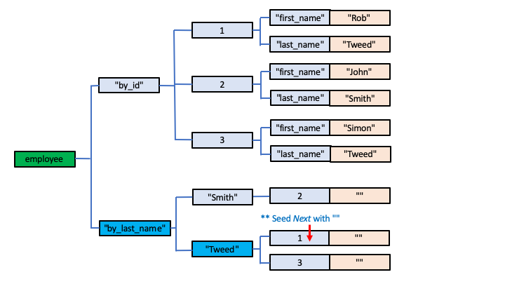
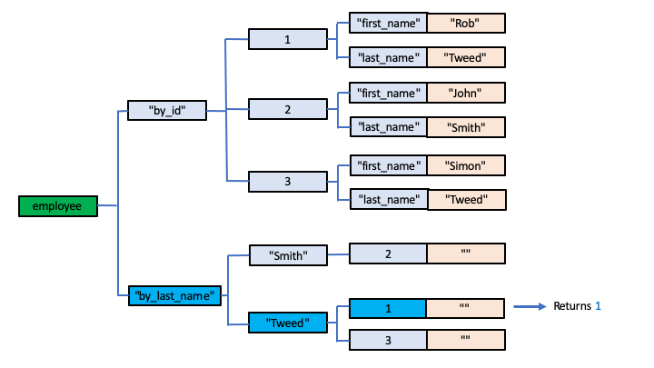
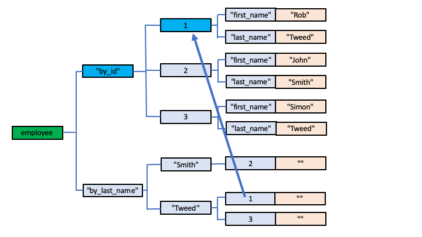
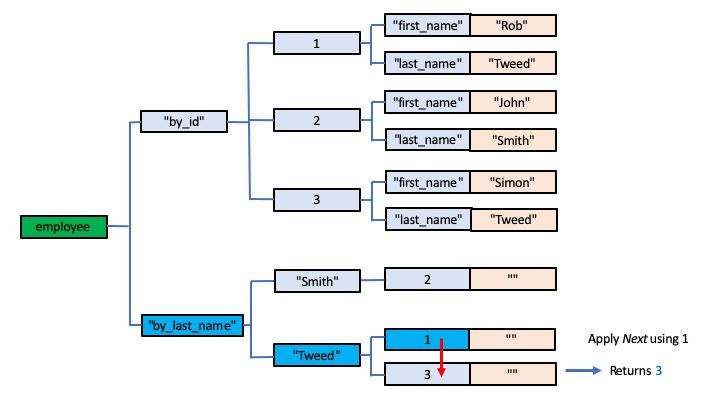
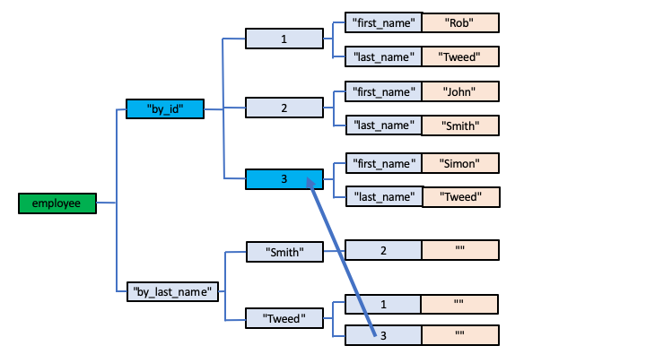
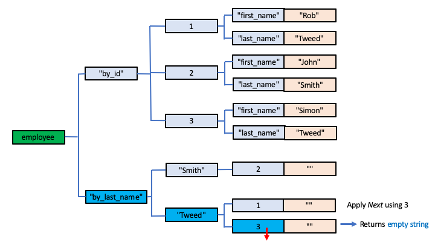

# Indexing in Global Storage

Unlike many "conventional" databases, a Global Storage database does not provide any form of automatic indexing of data records.

Indexing is an important feature of databases: an index provides the means by which you can efficiently and rapidly (in many cases near instantaneously) access a specific record that you're interested in, instead of an slow, exhaustive search through the entire database.  Without an index, you probably might as well store data in a text file!

Global Storage databases leave indexing entirely in your hands.  While this might seem like a retrograde step to someone used to the built-in convenience and "bells and whistles" of a modern database, it actually provides a database designer with the ability to design exactly the indexing strategy they need for their particular circumstances.  This can result in more efficient overall data storage: indices that are unlikely to ever be needed don't end up wasting disk storage, and, in skilled, experienced hands, a much more effecive and performant indexing strategy can be designed than often created by leaving it to the database management system to decide.

To use a photography analogy, it's like the difference between using modern automatic lenses and selecting completely automatic settings on your camera for exposure and auto-focus, compared with using manual lenses and a manual exposure setting on the camera, leaving the photographer to take control and use their experience and creative expertise.

# What is an Index Anyway?

Because many databases include automatic indexing behind the scenes, you may not even really know what an index is or what it looks like.  It's actually very simple really, but the design of indices also brings into focus the need to carefully focus on your database structure and design as a whole.

Let's go back to the employee database examples we've used throughout these articles.  In fact, the examples that have been used so far are actually pretty badly designed, but they were described to allow easy understanding of basic Global Storage techniques.

## Data Records versus Indices

It's good practice in Global Storage database design to start with the design of the basic database records you're interested in.  In our case we're interested in employees, each of whom have a number of properties, such as their name, demographic information, which office they work in and what role they have within that office.

Some of the things we'll want to do with such an employee database is to answer questions such as:

- which employees work in a particular office within a particular country? 
- what offices are there in a particular country?
- find all the IT consultants employed in UK offices

With Global Storage, there's no one right or wrong way to design such a database, and different developers might come up with very different designs.  But I'll outline a design that would work very well and would make use of Global Storage very efficiently.

The first thing is to identify the main *entities* we're interested in.  There are three in our example:

- employees
- offices
- countries

Each country may have one of more offices, and each office has one or more employees.  This defines our *entity relationship*.

I'm going to start, therefore with employees.  I'll use this Global structure:

        employee["by_id",id, property_name] = property_value

The first subscript - *by_id* has, under it, each and every employee record, each one defined by a second subscript that defines the employee's unique *Id*.

I'm going to assume that the id used for Global Storage is an effectively meaningless integer value, assigned automatically whenever a new employee is added to the database.  For example, an employee record might contain:

        employee["by_id", 29, "first_name"] = "Rob"
        employee["by_id", 29, "last_name"]  = "Tweed"

So where and how will the id values be created and assigned?

For this we'll need a *counter* which we'll increment each time we want to allocate a new Id.

        employee["counter"] = last_id_number

To obtain the next id, we can make use of a Global Storage API we've not previously mentioned, which is ideally suited for this kind of functionality: *Increment*.

### The *Increment* API

The *Increment* Id requires two arguments, allowing you to specify a Global Node:

- Global Name (eg *employee*)
- An array or list of subscripts (eg ["counter"])

If the specified Global Node does not currently exist, its value is set to 1 and a value of 1 is returned.

If the specified Global Node does exist:

- if it currently has a numeric value, it is incremented by 1.  The new value replaces the previous value in the Global Node, and that new value is also returned.

- if it currently has a string value that does not start with any numeric characters, its value is replaced with the integer value 1, and 1 is returned

- if it has a string value that commences with a number other than zero and which is followed by zero, one or more numbers, the numeric component of the prefix is incremented by 1, the resulting value replaces the previous value in the Global Node, and that value is also returned.

For example:

- if employee["counter"] doesn't yet exist, incrementing it will create:

        employee["counter"] = 1

  and the value 1 will be returned as the result of the *Increment* API.

- if:

        employee["counter"] = 1

  then incrementing it will create:

        employee["counter"] = 2

  and 2 will be returned as the result of the *Increment* API.

The above scenarios are the normal usage of *Increment*.

However, you need to be aware of the effects you can get if you apply it to other nodes.  For example:

- if:

        employee["counter"] = "hello world"

  then incrementing it will create:

        employee["counter"] = 1

  and 1 will be returned as the result of the *Increment* API.

Perhaps more apparently bizarrely:

- if:

        employee["counter"] = "23hello world"

  then incrementing it will create:

        employee["counter"] = 24

  This is because the existing string value ("23hello world") is evaluated as if it was the integer value 23 because it starts with the numbers "23".  Any subsequent non-numeric values are discarded.

Pretty weird effects, I'll admit, but my golden rule is to only apply the *Increment* API to Global Nodes that you are using as an integer counter record.

### Creating a new Employee Record

We can now envisage how a new Employee Record would be created:

- first, increment the Counter node.  This will return the next available Id number
- use the returned integer value as the Id for the new employee record
- save the employee's property values

So the first time we create an employee record, we'd have created:

        employee["by_id", 1, "first_name"] = "Rob"
        employee["by_id", 1, "last_name"] = "Tweed"
        employee["counter"] = 1

Adding a second:

        employee["by_id", 1, "first_name"] = "Rob"
        employee["by_id", 1, "last_name"] = "Tweed"
        employee["by_id", 2, "first_name"] = "John"
        employee["by_id", 2, "last_name"] = "Smith"
        employee["counter"] = 2

and so on.

### Indexing by Last Name

Clearly with this database design, the user has no way of knowing the Id used for, say, John Smith's database record.  So, how can the request: "get me all the employees with a last name of Smith* be answered?  As it currently stands, the only way this could be done would be to exhaustively search every employee record in the database.  With just 2 records in the database, as shown above, this, of course, would not pose much of a problem, but in the real-world scenario there may be many thousands of employee records in the database.

So this is where an Index comes in.  Let's extend the Global Storage to include:

        employee["by_last_name", last_name, id] = ""

and, whenever an employee record is created, also create the corresponding instance of this Node as well.

In other words, the first time we create an employee record, we'd now have created:

        employee["by_id", 1, "first_name"] = "Rob"
        employee["by_id", 1, "last_name"] = "Tweed"

        employee["by_last_name", "Tweed", 1] = ""

        employee["counter"] = 1

and adding a second employee, we'd end up with:

        employee["by_id", 1, "first_name"] = "Rob"
        employee["by_id", 1, "last_name"] = "Tweed"
        employee["by_id", 2, "first_name"] = "John"
        employee["by_id", 2, "last_name"] = "Smith"

        employee["by_last_name", "Smith", 2] = ""
        employee["by_last_name", "Tweed", 1] = ""

        employee["counter"] = 2

Let's add a third employee:

        employee["by_id", 1, "first_name"] = "Rob"
        employee["by_id", 1, "last_name"] = "Tweed"
        employee["by_id", 2, "first_name"] = "John"
        employee["by_id", 2, "last_name"] = "Smith"
        employee["by_id", 3, "first_name"] = "Simon"
        employee["by_id", 3, "last_name"] = "Tweed"

        employee["by_last_name", "Smith", 2] = ""
        employee["by_last_name", "Tweed", 1] = ""
        employee["by_last_name", "Tweed", 3] = ""

        employee["counter"] = 3

Note, of course, that the last names in the "by_last_name" index records are automatically sorted alphabetically for us.

### Using an Index

If we want to find all the employees whose last name is Tweed, we can now use the "by_last_name" index records within the Global.  This is where the *Next* API comes in.  We'd implement an iteration loop that starts:

        Next employee["by_last_name", "Tweed"], ""  // seed using an empty string

This will return 1, being the first instance of the third subscript for this Intermediate Node.

So we can now retrieve the first record for an employee with a last name of *Tweed* - his *id* is this returned value of 1.  In other words we can access this employee's data records:

        employee["by_id", 1, "first_name"] = "Rob"
        employee["by_id", 1, "last_name"] = "Tweed"

To get the next one:

        Next employee["by_last_name", "Tweed"], 1  // seed using the value returned by the previous Next

This will return the value 3, and we can now access:

        employee["by_id", 3, "first_name"] = "Simon"
        employee["by_id", 3, "last_name"] = "Tweed"

To get the next one:

        Next employee["by_last_name", "Tweed"], 3

Currently there are no more records, so an empty string value is returned, telling us that we've accessed all the employees named *Tweed*.

### Visualising Our Index Example

The following diagrams may help visualise what we're doing:

Here's our example database.  I've left out the *counter* record for clarity as it servers no purpose in this explanation of the use of an index.

We want to get all the employee records whose last name is *Tweed*.

The first step is to set a pointer to the highlighted Intermediate Node, ie

        employee["by_last_name", "Tweed"]

and we seed the *Next* API for that Intermediate Node using an initial empty string value:

That returns the first of the specified Node's child subscripts (ie in collating sequence), which is the value 1:

That returned value represents the *id* value for the corresponding data (*by_id*) record, we can now access it as shown:

To get the next *Tweed* employee record, we invoke the *Next* API to the selected *by_last_name* Node, this time feeding in the previously returned *id* value.  The next child subscript value is returned, which is a value of 3.

so we can now access the data records for employee *3* as shown:

These steps are repeated.  In our example, however, when we invoke the *Next* API using a seed value of 3, there are no more child subscript values for the selected *by_last_name* Node, so an empty string value is returned.  This tells us that the search has been exhausted.

