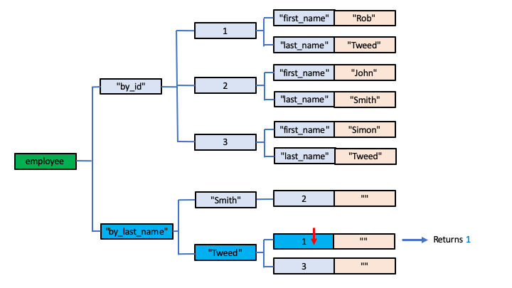

# Indexing in Global Storage

Unlike many "conventional" databases, a Global Storage database does not provide any form of automatic indexing of data records.

Indexing is an important feature of databases: an index provides the means by which you can efficiently and rapidly (in many cases near instantaneously) access a specific record that you're interested in, instead of an slow, exhaustive search through the entire database.  Without an index, you probably might as well store data in a text file!

Global Storage databases leave indexing entirely in your hands.  While this might seem like a retrograde step to someone used to the built-in convenience and "bells and whistles" of a modern database, it actually provides a database designer with the ability to design exactly the indexing strategy they need for their particular circumstances.  This can result in more efficient overall data storage: indices that are unlikely to ever be needed don't end up wasting disk storage, and, in skilled, experienced hands, a much more effecive and performant indexing strategy can be designed than often created by leaving it to the database management system to decide.

To use a photography analogy, it's a bit like the difference between using modern automatic lenses and selecting completely automatic settings on your camera for exposure and auto-focus, compared with using manual lenses and a manual exposure setting on the camera, leaving the photographer to take control and use their experience and creative expertise.  The novice or casual photographer can leave it to the camera to make the decisions which it will probably do well enough most of the time for you to be happy with the photographs.  However, the expert photographer can use their skill and experience to cater for more challenging situations which, left to the camera, might result in the subject of the photograph being badly over-exposed or under-exposed, or the subject being out of focus.

# What is an Index Anyway?

Because many databases include automatic indexing behind the scenes, you may not even really know what an index is or what it looks like.  They are simply other records stored in the database, but they act as pointers to the main data records, and are designed around the search criteria you'll use when querying your database.

It's actually very simple really, but the design of indices also brings into focus the need to carefully focus on your database structure and design as a whole.

Let's go back to the employee database examples we've used throughout these articles.  In fact, the examples that have been used so far are actually pretty badly designed, but they were described to allow easy understanding of basic Global Storage techniques.

## Data Records versus Indices

It's good practice in Global Storage database design to start with the design of the basic database records you're interested in.  In our case we're interested in employees, each of whom have a number of properties, such as their name, demographic information, which office they work in and what role they have within that office.

Some of the things we'll want to do with such an employee database is to answer questions such as:

- which employees work in a particular office within a particular country? 
- what offices are there in a particular country?
- find all the IT consultants employed in UK offices

With Global Storage, there's no one right or wrong way to design such a database, and different developers might come up with very different designs.  But I'll outline a design that would work very well and would make use of Global Storage very efficiently.

The first thing is to identify the main *entities* we're interested in.  There are three in our example:

- employees
- offices
- countries

Each country may have one of more offices, and each office has one or more employees.  This defines our *entity relationship*.

I'm going to start, therefore with employees.  I'll use this Global structure:

        employee["by_id",id, property_name] = property_value

The first subscript - *by_id* has, under it, each and every employee record, each one defined by a second subscript that defines the employee's unique *Id*.

I'm going to assume that the id used for Global Storage is an effectively meaningless integer value, assigned automatically whenever a new employee is added to the database.  For example, an employee record might contain:

        employee["by_id", 29, "first_name"] = "Rob"
        employee["by_id", 29, "last_name"]  = "Tweed"

So where and how will the id values be created and assigned?

For this we'll need a *counter* which we'll increment each time we want to allocate a new Id.

        employee["counter"] = last_id_number

To obtain the next id, we can make use of a Global Storage API we've not previously mentioned, which is ideally suited for this kind of functionality: *Increment*.

### The *Increment* API

The *Increment* Id typically requires two arguments, allowing you to specify a Global Node:

- Global Name (eg *employee*)
- An array or list of subscripts (eg ["counter"])

If the specified Global Node does not currently exist, its value is set to 1 and a value of 1 is returned.

If the specified Global Node does exist, its value is incremented by 1.  The new value replaces the previous value in the Global Node, and that new value is also returned.

For example:

- if employee["counter"] doesn't yet exist, incrementing it will create:

        employee["counter"] = 1

  and the value 1 will be returned as the result of the *Increment* API.

- if:

        employee["counter"] = 1

  then incrementing it will create:

        employee["counter"] = 2

  and 2 will be returned as the result of the *Increment* API.

Note that you can also provide a third argument, which allows you to specify the amount to increment or even decrement.  By default, the increment value is +1, but you can specify any positive or negative integer value.  For Id generation, just use the default.

Note also that the *Increment* API is usually implemented to safely and reliably allow concurrent multi-user access, avoiding any risk of two users invoking it simultaneously and being returned the same value.

### Creating a new Employee Record

We can now envisage how a new Employee Record would be created:

- first, increment the Counter node.  This will return the next available Id number
- use the returned integer value as the Id for the new employee record
- save the employee's property values

So the first time we create an employee record, we'd have created:

        employee["by_id", 1, "first_name"] = "Rob"
        employee["by_id", 1, "last_name"] = "Tweed"
        employee["counter"] = 1

Adding a second:

        employee["by_id", 1, "first_name"] = "Rob"
        employee["by_id", 1, "last_name"] = "Tweed"
        employee["by_id", 2, "first_name"] = "John"
        employee["by_id", 2, "last_name"] = "Smith"
        employee["counter"] = 2

and so on.

### Indexing by Last Name

Clearly with this database design, the user has no way of knowing the Id used for, say, John Smith's database record.  So, how can the request: "get me all the employees with a last name of Smith* be answered?  As it currently stands, the only way this could be done would be to exhaustively search every employee record in the database.  With just 2 records in the database, as shown above, this, of course, would not pose much of a problem, but in the real-world scenario there may be many thousands of employee records in the database.

So this is where an Index comes in.  Let's extend the Global Storage to include:

        employee["by_last_name", last_name, id] = ""

and, whenever an employee record is created, also create the corresponding instance of this Node as well.

In other words, the first time we create an employee record, we'd now have created:

        employee["by_id", 1, "first_name"] = "Rob"
        employee["by_id", 1, "last_name"] = "Tweed"

        employee["by_last_name", "Tweed", 1] = ""

        employee["counter"] = 1

and adding a second employee, we'd end up with:

        employee["by_id", 1, "first_name"] = "Rob"
        employee["by_id", 1, "last_name"] = "Tweed"
        employee["by_id", 2, "first_name"] = "John"
        employee["by_id", 2, "last_name"] = "Smith"

        employee["by_last_name", "Smith", 2] = ""
        employee["by_last_name", "Tweed", 1] = ""

        employee["counter"] = 2

Let's add a third employee:

        employee["by_id", 1, "first_name"] = "Rob"
        employee["by_id", 1, "last_name"] = "Tweed"
        employee["by_id", 2, "first_name"] = "John"
        employee["by_id", 2, "last_name"] = "Smith"
        employee["by_id", 3, "first_name"] = "Simon"
        employee["by_id", 3, "last_name"] = "Tweed"

        employee["by_last_name", "Smith", 2] = ""
        employee["by_last_name", "Tweed", 1] = ""
        employee["by_last_name", "Tweed", 3] = ""

        employee["counter"] = 3

Note, of course, that the last names in the "by_last_name" index records are automatically sorted alphabetically for us.

# Using an Index

Using Indices in Global Storage is easiest explained using an example, so we'll continue with the one we've been developing so far.

Indices come into play when you want to access one or more data records by one or more particular criteria - such as the employee's name.

So, for example, if we want to find all the employees whose last name is Tweed, we can use the "by_last_name" index records within the Global.  This is where the Global Storage [*Next*](./Subscripts.md#next) API comes in.  We'd implement an iteration loop that starts:

        Next employee["by_last_name", "Tweed"], ""  // seed using an empty string

This will return 1, being the first instance of the third subscript for this Intermediate Node.

So we can now retrieve the first record for an employee with a last name of *Tweed* - his *id* is this returned value of 1.  In other words we can access this employee's data records:

        employee["by_id", 1, "first_name"] = "Rob"
        employee["by_id", 1, "last_name"] = "Tweed"

To get the next one:

        Next employee["by_last_name", "Tweed"], 1  // seed using the value returned by the previous Next

This will return the value 3, and we can now access:

        employee["by_id", 3, "first_name"] = "Simon"
        employee["by_id", 3, "last_name"] = "Tweed"

To get the next one:

        Next employee["by_last_name", "Tweed"], 3

Currently there are no more records, so an empty string value is returned, telling us that we've accessed all the employees named *Tweed*.

## Visualising Our Index Example

The following diagrams may help visualise what we're doing:

Here's our example database.  I've left out the *counter* record for clarity as it servers no purpose in this explanation of the use of an index.

We want to get all the employee records whose last name is *Tweed*.

The first step is to set a pointer to the highlighted Intermediate Node, ie

        employee["by_last_name", "Tweed"]

and we seed the *Next* API for that Intermediate Node using an initial empty string value:

That returns the first of the specified Node's child subscripts (ie in collating sequence), which is the value 1:

That returned value represents the *id* value for the corresponding data (*by_id*) record, we can now access it as shown:

To get the next *Tweed* employee record, we invoke the *Next* API to the selected *by_last_name* Node, this time feeding in the previously returned *id* value.  The next child subscript value is returned, which is a value of 3.

so we can now access the data records for employee *3* as shown:

These steps are repeated.  In our example, however, when we invoke the *Next* API using a seed value of 3, there are no more child subscript values for the selected *by_last_name* Node, so an empty string value is returned.  This tells us that the search has been exhausted.

# Same or Separate Globals for Data Records and Indices?

The example so far has combined both the data records (the *by_id* Nodes) with index records (the *by_last_name* Nodes).  Whilst that's a perfectly acceptable and frequently-used pattern, there is also a school of thought that you should use different Globals.  In other words, the same functionality could have been achieved using this pattern:

        employee[1, "first_name"] = "Rob"
        employee[1, "last_name"] = "Tweed"
        employee[2, "first_name"] = "John"
        employee[2, "last_name"] = "Smith"
        employee[3, "first_name"] = "Simon"
        employee[3, "last_name"] = "Tweed"

        employeeIndex["by_lastName", 2] = ""
        employeeIndex["by_last_name", "Tweed", 1] = ""
        employeeIndex["by_last_name", "Tweed", 3] = ""

        employeeId["counter"] = 3

Note that in the above example I've also used a separate Global for the Id counter.

Flexibility is a key feature of Global Storage, and there's no right or wrong way to design your data and Index Global Storage.

# Indices Should Always be Derived from Data Records

Global Storage won't force you to design your data records and Indices in any particular way, but a very good practice to adopt is to always make sure that there is no unique information maintained within an Index.  An index should always just contain information that is held and maintained in the data records: ie an index should always be a transformation of information held in data records.

In doing so, provided you have a back-up of your data records, it means you can always re-create your indices by re-processing the data records.

In practice, you'll find that, as in the example above, the key part of an index is its subscripts which will point to either subscripts or data values in the Data records.  You'll also find that index record Leaf Nodes rarely need to have a value other than an empty string, as in the example above.  Indices are therefore used as pointers to the Data records, based on some particular search strategy.

# Extending our Example

Consider the following extension to our example which adds the employee's role and office to the Data records, and maintains two new indices (*by_role* and *by_office*):

        employee["by_id", 1, "first_name"] = "Rob"
        employee["by_id", 1, "last_name"] = "Tweed"
        employee["by_id", 1, "office"] = "London"
        employee["by_id", 1, "role"] = "Consultant"

        employee["by_id", 2, "first_name"] = "John"
        employee["by_id", 2, "last_name"] = "Smith"
        employee["by_id", 2, "office"] = "Bristol"
        employee["by_id", 2, "role"] = "Programmer"

        employee["by_id", 3, "first_name"] = "Simon"
        employee["by_id", 3, "last_name"] = "Tweed"
        employee["by_id", 3, "office"] = "London"
        employee["by_id", 3, "role"] = "Programmer"

        employee["by_last_name", "Smith", 2] = ""
        employee["by_last_name", "Tweed", 1] = ""
        employee["by_last_name", "Tweed", 3] = ""

        employee["by_role", "Consultant", 1] = ""
        employee["by_role", "Programmer", 2] = ""
        employee["by_role", "Programmer", 3] = ""

        employee["by_office", "Bristol", 2] = ""
        employee["by_office", "London", 1] = ""
        employee["by_office", "London", 3] = ""

        employee["counter"] = 3

So now we can answer the questions: 

- who are the employees of the London office?
- who are the programmers in the organisation?

We could also efficiently answer the question:

- who are the programmers in the London office?

We could do this by traversing the *by_role* index for *Programmer*, and for each *id* found in it, check (using the *Data* API) if that *id* also exists in the *by_office* index for *London*.

Alternatively, to answer that question, you could design and maintain a composite index, eg:

        employee["by_role_and_office", "Consultant", "London", 1] = ""
        employee["by_role_and_office", "Programmer", "Bristol", 2] = ""
        employee["by_role_and_office", "Programmer", "London", 3] = ""

The flexibility of Global Storage means it's up to you to design what you need for your particular circumstances.

# Maintaining Indices

It's up to you how many indices you maintain and how they are structured, but, of course, you have to rememeber that Global Storage itself does nothing to maintain them: it's all up to you.  The more indices you decide to use, the more logic you need to design and write to maintain them.

You need to remember that your database is likely to be quite a dynamic thing: you're not simply going to be adding new records to the database.  There will be times when you need to change data record values, and times when you'll need to delete data records.  These changes need to also be reflected in your indices: you can't risk having index records that are out of synchronisation with the data records to which they are supposed to point.

Typically, you'll write APIs to implement these create/edit/delete actions for your database:

- add: This will allocate a new Id for the entity, store its data records and then create its appropriate index records

- edit: This will change a particular Data Record's Leaf Node value, and, if this is a value that is used in one or more indices, the original index must be deleted and a new index created based on the new value

- delete: This will first use the Data Records to determine which Index records need to be deleted, and once these index records are deleted, the Data Records can be deleted.

Let's illustrate some examples in action.

## Add a new Employee

This will create the data records:

        employee["by_id", 4, "first_name"] = "David"
        employee["by_id", 4, "last_name"] = "Jones"
        employee["by_id", 4, "office"] = "Bristol"
        employee["by_id", 4, "role"] = "Manager"

and the index records:

        employee["by_last_name", "Jones", 4] = ""
        employee["by_role", "Manager", 4] = ""
        employee["by_office", "Bristol", 4] = ""

## Edit an Indexed Value

If we change:

        employee["by_id", 1, "role"] = "Consultant"

to:

        employee["by_id", 1, "role"] = "Director"

then this index record must be deleted:

        employee["by_role", "Consultant", 1] = ""

and this new index record must be created:

        employee["by_role", "Director", 1] = ""

## Delete an Employee Record

If we wanted to delete this Employee Data Record:

        employee["by_id", 2, "first_name"] = "John"
        employee["by_id", 2, "last_name"] = "Smith"
        employee["by_id", 2, "office"] = "Bristol"
        employee["by_id", 2, "role"] = "Programmer"

We would first go through the indexed properties (*last_name*, *office* and *role*) and delete the corresponding index records:

        employee["by_last_name", "Smith", 2] = ""
        employee["by_role", "Praogrammer", 2] = ""
        employee["by_office", "Bristol", 2] = ""

before deleting the data (ie the *by_id*) records.

----

# Using Coded Values

Although not strictly-speaking an Indexing issue, let's round off this document by adding some further refinements to our database and introduce the idea of coded items.

Consider the *role* and *office* properties for our Data records.  Currently they are being stored as text values, eg *London*, *Bristol*, *Programmer*, etc.  It would arguably be better to maintain lists of "official" values for these in the database, by using further Globals, eg:

        office["by_id", 1] = "London"
        office["by_id", 2] = "Bristol"
        office["by_id", 3] = "New York"

        office["by_name", "Bristol"] = 2
        office["by_name", "London"] = 1
        office["by_name", "New York"] = 3

        office["counter"] = 3

Note that if the office name is to be unique, then we can use an index Leaf Node whose value points to the corresponding Id.

Similarly, for roles:

        role["by_id", 1] = "Director"
        role["by_id", 2] = "Consultant"
        role["by_id", 3] = "Programmer"
        role["by_id", 4] = "Manager"      

        role["by_name", "Consultant"] = 2
        role["by_name", "Director"] = 1
        role["by_name", "Manager"] = 4
        role["by_name", "Programmer"] = 3

        role["counter"] = 4

These Globals can now be used for the User Interface to generate the menu options from which a user can select the office or role when maintaining the Employee records.

With these coded entities in place, we can now modify the Employee record design:

        employee["by_id", 1, "first_name"] = "Rob"
        employee["by_id", 1, "last_name"] = "Tweed"
        employee["by_id", 1, "office"] = 1            (value 1 = London)
        employee["by_id", 1, "role"] = 2              (value 2 = Consultant)

        employee["by_id", 2, "first_name"] = "John"
        employee["by_id", 2, "last_name"] = "Smith"
        employee["by_id", 2, "office"] = 2
        employee["by_id", 2, "role"] = 3

        employee["by_id", 3, "first_name"] = "Simon"
        employee["by_id", 3, "last_name"] = "Tweed"
        employee["by_id", 3, "office"] = 1
        employee["by_id", 3, "role"] = 3

        employee["by_last_name", "Smith", 2] = ""
        employee["by_last_name", "Tweed", 1] = ""
        employee["by_last_name", "Tweed", 3] = ""

        employee["by_role", 2, 1] = ""               (2nd subscript value 2 = Consultant)
        employee["by_role", 3, 2] = ""               (2nd subscript value 3 = Programmer)
        employee["by_role", 3, 3] = ""

        employee["by_office", 1, 1] = ""              (2nd subscript value 1 = London)
        employee["by_office", 1, 3] = ""
        employee["by_office", 2, 2] = ""              (2nd subscript value 2 = Bristol)

        employee["counter"] = 3

Now, of course, the data index records are now a lot less human-readable and much more abstract, and require knowledge of the *role* and *office* Globals to give them meaning.  However, they are a lot more computable and maintainable and, as noted earlier, allow integration with User Interface applications for generating selection menus.

Note, as I've frequently pointed out in this document, Global Storage does not force you to design your database and its indices in any particular way.  The design, logic and semantics of your database is entirely up to you and entirely in your control.  What is described above is simply one suggestion for your guidance and is also to demonstrate how you can use and apply Global Storage to create a highly functional and high-performance database.

