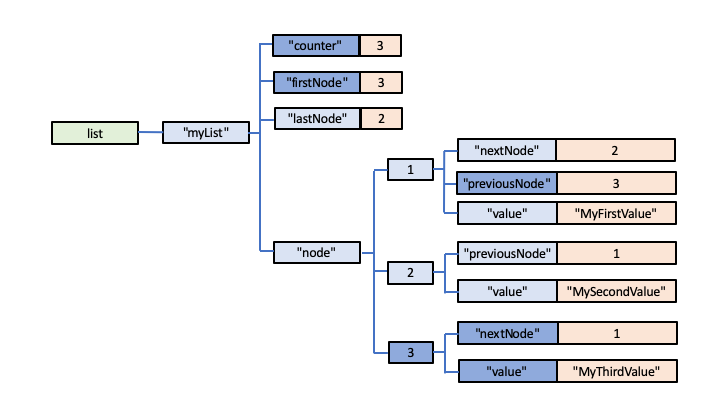

# Key/Value Storage using Globals

## Basic Key/Value Storage

Implementing basic Key/Value storage is very simple with Global Storage.  It's simply a matter of using this very basic Global Structure:

        keyValueStore[key] = value

For example:

        telephone["211-555-9012"] = "James, George"
        telephone["617-555-1414"] = "Tweed, Rob" 

Viewed diagrammatically, this set of key/value pairs would look like this within a Global:

To add a record to the Key/Value Store:

        SET telephone[number] = name

To get a name if you know a key:

        name = GET telephone[number]

To update a value for a particular key:

        SET telephone[number] = new_name

To remove a record:

        KILL telephone[number]

To delete the entire telephone Key/Value store:

        KILL telephone

# Lists

Redis includes a data structure that it names a *List*.  You can push a value onto either the start or end of the *List*.  Similarly you can pull a value from the start or end of the *List*, which also removes the value from the *List*.  You can also list the values currently stored in a *List*, either the entire *List* or just part of it, or you can trim a list, specifying the number of *List* values you want to retain.

You can implement such a scheme in Global Storage as a Linked List, which could be implemented using this model:

        list[listName, "firstNode"] = first_node_number
        list[listName, "lastNode"] = last_node_number
        list[listName, "node", node_number, "value"] = value
        list[listName, "node", node_number, "nextNode"] = next_node_number
        list[listName, "node", node_number, "previousNode"] = previous_node_number 
        list[listName, "counter"] = latest_node_number

To add a first value (eg "myFirstValue") to a *List* named *MyList*, we would first increment the counter node:

        INCREMENT list["myList", "counter"]

        which would return a value of 1 and creater the node:

        list["myList", "counter"] = 1

The first value can then be added to the List, creating the nodes:

        list["MyList", "firstNode"] = 1
        list["MyList", "lastNode"] = 1
        list["MyList", "node", 1, "value"] = "MyFirstValue"

Of course, it wouldn't matter whether you added the first value to the start or end of the *List*.

So what about pushing a value of "MySecondValue" onto the end of the list?  The node counter Node would first be incremented to get the next new node number (in this case 2).  Then the new value would be appended to the end of the list by changing the Global Nodes to:

        list["MyList", "firstNode"] = 1
        list["MyList", "lastNode"] = 2
        list["MyList", "node", 1, "value"] = "MyFirstValue"
        list["MyList", "node", 1, "nextNode"] = 2
        list["MyList", "node", 2, "previousNode"] = 1
        list["MyList", "node", 2, "value"] = "MySecondValue"
        list["myList", "counter"] = 2

It's probably easiest to understand this by visualising it as follows:

Here's the structure above shown diagrammatically:

Now, suppose we want to get and display all the values in this List.  We'd first get the value of the *firstNode* Node, which is 1:

        GET list["MyList", "firstNode"]  // returns 1

and then use this value to get the first node's value:

        GET list["MyList", "node", 1, "value"]   // returns "MyFirstValue"

ie:

To get the next node, we use the "nextNode" pointer value, ie:

        GET list["MyList", "node", 1, "nextNode"]   // returns 2

so we now know the Intermediate Node for the next node in the list:

        list["MyList", "node", 2]

ie:

So now we can get the value for this second node in the List:

        GET list["MyList", "node", 2, "value"]   // returns "MySecondValue"

The process repeats, but not before a check is made to see if the current node (ie 2)
is the last node in the list, by looking at the value of the "lastNode" node, ie:

        GET list["myList","lastNode"]   // returns 2

So in this instance we can see that our second List node is the last node, so processing can stop: we've retrieved all the values in the list.

You can hopefully see how you could also retrieve all the list values in reverse order, by starting at the *lastNode* and then using each node's *previousNode* pointer until the *firstNode* is reached.

So far in this example, a linked list seems like overkill, since we only have node numbers 1 and 2 - couldn't we have just retrieved them consecutively?  The answer is no, and it's easiest demonstrated by adding a new, third, value to the List, only this time adding it to the start of the List.  This would result in this structure:

        list["MyList", "firstNode"] = 3
        list["MyList", "lastNode"] = 2
        list["MyList", "node", 1, "value"] = "MyFirstValue"
        list["MyList", "node", 1, "nextNode"] = 2
        list["MyList", "node", 1, "previousNode"] = 3
        list["MyList", "node", 2, "previousNode"] = 1
        list["MyList", "node", 2, "value"] = "MySecondValue"
        list["MyList", "node", 3, "nextNode"] = 1
        list["MyList", "node", 3, "value"] = "MyThirdValue"
        list["myList", "counter"] = 3

This time, retrieving the list items in order will retrieve node 3, then 1, then 2.

Retrieving in reverse order will retrieve node 2, then 1, then 3.

So you can now see that the node numbers used for storage in the Global are purely arbitrary, simply reflecting the sequence in which they were added, but not reflecting their position in the List itself.

Here's our updated, 3-element list shown diagrammatically.  The added and modified nodes are highlighted in dark blue.

So with this structure, it doesn't matter whether new values are added to the start or end of the list.  Provided the pointer nodes are maintained correctly, the Linked List structure works perfectly, and actually very efficiently.

