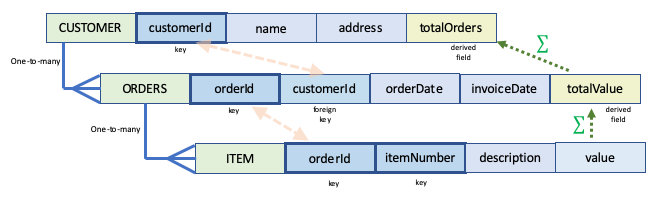

# Implementing a Relational Database using Globals

## What is a Relational Database?

In a Relational Database, information is represented as sets of 2-dimensional tables, with relationships between the tables described in terms of:

- one-to-one relationships
- one-to-many relationships
- many-to-many relationships

The data in a table is defined as a set of columns, with each column representing a property or attribute.  Each row in the table represents the data for an individual member of that table, for example, an individual person, or perhaps an individual invoice.

One or more of the columns (also known as *fields*) in a table will be defined as *keys* or *key fields*. The values for a table's keys define a unique member of the table: in other words, there can only be one member of the table with a particular set of values for the key fields.

Conversely, one or more rows in a table can have the same values for non-key fields.

Related tables will have some relationship between the keys of one table and the fields of the other.

Relational Databases are also associated with the Structured Query Language (SQL) which allows querying within and between tables, the latter based on the the relationships between them.

In this document I won't be referring to SQL: I'll be focusing on how a set of related tables can be defined using Global Storage.  The standard Global Storage APIs can be used for basic querying, but it's entirely possible to then implement SQL as a query language for those tables.  The main native implementations of Global Storage databases all have SQL implementations available.

## Example of Relational Tables

It's probably easiest to explain how to model a Relational Database using Global Storage by using a straightforward example.  Consider the following:

- a table representing customers (*CUSTOMER*)
- a table representing orders (*ORDERS*)
- a table representing the individual items that make up an order

In terms of relationships:

- a customer can place one or more orders
- an order is made up of one or more items

The table columns or fields are as follows:

- CUSTOMER:

  - customerId: a unique customer identifier.  This is this table's one and only *key* field.
  - name: the customer's name
  - address: the customer's address
  - totalOrders: the total number of orders placed by this customer to date

- ORDERS:

  - orderId: a unique order identifier.  This is this table's one and only *key* field.
  - customerId: the id of the customer who placed the order. This provides the relationship back to the member of the CUSTOMER table that placed the order.  It is not a key field for ORDERS, but as it is a *key field* in another table, it is referred to as a *foreign key* within the ORDERS table.
  - orderDate: the date the order was placed
  - invoiceDate: the date on which the order was invoiced
  - totalValue: the total value of the order in, let's say, UK pounds.

- ITEM:

  - orderId: the identifier of the order to which this item belongs.  This is a *key* field for this table.
  - itemNumber: the item number within the order.  This is also a *key* field for this table.
  - description: text describing the item
  - value: the value of the item

  In the ITEM table, therefore, rows are uniquely defined by a combination of two *key fields*: *orderId* and *itemNumber*.

Note that in the CUSTOMER table, the *totalOrders* field is not intended to be specified by a user.  Instead it is intended to be calculated automatically, being the sum of all *totalValue* fields in the ORDERS table, for orders placed by this customer.  As such, this field is known as a *derived field*.

Similarly, the *totalValue* field within the ORDERS table is, itself, a *derived field*, being the sum of all the *value* fields for members of the ITEM table belonging to the same *orderId*.

Here is this set of tables, summarised in diagrammatic form:

## Global Storage Representation

A Relational Database normally requires such table definitions to be formally defined/specified.  This is often done via [SQL commands](https://www.w3schools.com/sql/sql_primarykey.ASP).

Global Storage, of course, is schema-free, so, for SQL support of a relational database built using Global Storage, it's usually necessary to also create a set of Globals for the schemas that define relational tables.  This is beyond the scope of this document: we'll just focus on how the tables themselves could be modelled.

As always, there are numerous potential ways to model relational tables, but here's one such way:

The tables themselves could be defined using the model:

        tableName[key_1, (...key_n,) "fields", field_name] = field_value

while the relationship to other subsidiary tables could be modelled as:

        tableName[key_1, (...key_n,) "subtable", other_tableName, otherTableKey(s)] = ""

So for our example:

        CUSTOMER[customerId, "fields", "name"] = name
        CUSTOMER[customerId, "fields", "address"] = address
        CUSTOMER[customerId, "fields", "totalValue"] = totalValue
        CUSTOMER[customerId, "subtable", "ORDERS", orderId] = ""

        ORDERS[orderId, "fields", "customerId"] = customerId
        ORDERS[orderId, "fields", "orderDate"] = orderDate
        ORDERS[orderId, "fields", "invoiceDate"] = invoiceDate
        ORDERS[orderId, "fields", "totalValue"] = totalValue
        ORDERS[orderId", "subtable", "ITEM", orderId] = ""

        ITEM[orderId, itemNumber, "fields", "description"] = description
        ITEM[orderId, itemNumber, "fields", "value"] = value

So, for example, an actual populated set of tables might look like this:

        CUSTOMER[123, "fields", "name"] = "Rob Tweed"
        CUSTOMER[123, "fields", "address"] = "1, The Street, Redhill, Surrey"
        CUSTOMER[123, "fields", "totalValue"] = 100.00
        CUSTOMER[123, "subtable", "ORDERS", 28) = ""
        CUSTOMER[123, "subtable", "ORDERS", 42) = ""

        ORDERS[28, "fields", "customerId"] = 123
        ORDERS[28, "fields", "orderDate"] = "23/06/2020"
        ORDERS[28, "fields", "invoiceDate"] = "24/06/2020"
        ORDERS[28, "fields", "totalValue"] = 40.00
        ORDERS[28, "subtable", "ITEM", 28) = ""

        ORDERS[42, "fields", "customerId"] = 123
        ORDERS[42, "fields", "orderDate"] = "19/09/2020"
        ORDERS[42, "fields", "invoiceDate"] = "21/09/2020"
        ORDERS[42, "fields", "totalValue"] = 60.00
        ORDERS[42, "subtable", "ITEM", 42) = ""

        ITEM[28, 1, "fields", "description"] = "widget 1"
        ITEM[28, 1, "fields", "value"] = 10.00
        ITEM[28, 2, "fields", "description"] = "widget 2"
        ITEM[28, 2, "fields", "value"] = 25.00
        ITEM[28, 3, "fields", "description"] = "widget 3"
        ITEM[28, 3, "fields", "value"] = 5.00

        ITEM[42, 1, "fields", "description"] = "widget 4"
        ITEM[42, 1, "fields", "value"] = 60.00

