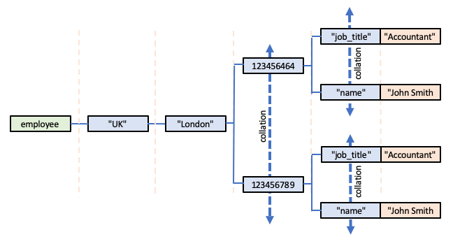
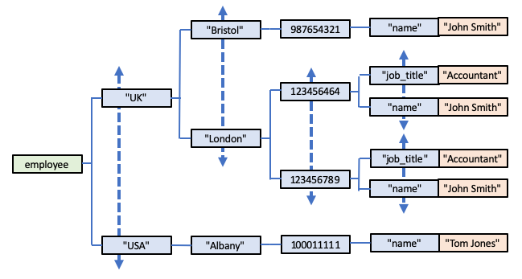

# The Magic of A Global's Subscripts

The subscripts of a Global have two absolutely key features that arguably give Global Storage its true power and flexibility:

- automatic alphanumeric collation
- built-in pointers to a subscript's previous and next sibling subscripts.

## Alphanumeric Collation of Subscripts

A deceptively simple, yet incredibly powerful characteristic of a Global's subscripts is that they are automatically collated in ASCII (ie alphanumeric) sequence.  This happens automatically when you use either the [*Set*](#set) or [*Kill*](#kill-or-delete) APIs:

- when you add/create a new Global Node, each of its subscripts is automatically collated in alphanumeric sequence with respect to its peers.

- when you delete a Global Node, any remaining peer subscripts are automatically re-ordered.

Let's see that collation mechanism in practice via an example.  Suppose we start by invoking:

        SET employee["UK", "London", 123456789, "name"] = "Rob Tweed"

If this is the first Node in the *employee* Global, then the Leaf Node with its associated value is created, along with its Intermediate Nodes.

So what happens when we next invoke:

        SET employee["UK", "London", 123456789, "job_title"] = "Consultant"

The Intermediate Node:

        employee["UK", "London", 123456789]

now has two Child Nodes, with subscripts of *name* and *job_title*.  But because *job_title* is, in alphanumeric collation terms before *name*, *job_title* automatically becomes the first subscript.  In other words, in terms of Global Storage, we now have:

        employee["UK", "London", 123456789, "job_title"] = "Consultant"
        employee["UK", "London", 123456789, "name"] = "Rob Tweed"

If we were to now invoke:

        SET employee["UK", "London", 123456789, "key_holder"] = 1

this would be automatically inserted between the two existing Nodes:

        employee["UK", "London", 123456789, "job_title"] = "Consultant"
        employee["UK", "London", 123456789, "key_holder"] = 1
        employee["UK", "London", 123456789, "name"] = "Rob Tweed"

Of course, if that newly inserted Node was *Kill*ed:

        KILL employee["UK", "London", 123456789, "key_holder"]

then the remaining subscripts automatically re-order themselves:

        employee["UK", "London", 123456789, "job_title"] = "Consultant"
        employee["UK", "London", 123456789, "name"] = "Rob Tweed"

This automatic collation occurs at all subscripting levels, so if we now invoke:

        SET employee["UK", "London", 123456464, "name"] = "John Smith"

then the third subscript - ie the child subscript of the *London* subscript - will be automatically collated with respect to other existing child subscripts of *London*.  In other words, the stored Nodes will look like this:

        employee["UK", "London", 123456464, "name"] = "John Smith"
        employee["UK", "London", 123456789, "job_title"] = "Consultant"
        employee["UK", "London", 123456789, "name"] = "Rob Tweed"

The collation is based on the alphanumeric value, and in this case the two subscript values are integers, with 123456464 sorting before the larger integer 123456789.

and of course, invoking this:

        SET employee["UK", "London", 123456464, "job_title"] = "Accountant"

will be collated as shown:

        employee["UK", "London", 123456464, "job_title"] = "Accountant"
        employee["UK", "London", 123456464, "name"] = "John Smith"
        employee["UK", "London", 123456789, "job_title"] = "Consultant"
        employee["UK", "London", 123456789, "name"] = "Rob Tweed"

Note that the collation of subscripts is with respect to their parent subscript, so the "job_title" and "name" subscripts are collated separately for the *123456464* and *123456789* parent subscripts.  It may help to represent these nodes visually to clarify this point:

Hopefully you can see why invoking the following two commands:

        SET employee["UK", Bristol", 987654321, "name"] = "John Smith"
        SET employee["USA", "Albany", 100011111, "name"] = "Tom Jones"

will result in the following collation:

        employee["UK", Bristol", 987654321, "name"] = "John Smith"
        employee["UK", "London", 123456464, "job_title"] = "Accountant"
        employee["UK", "London", 123456464, "name"] = "John Smith"
        employee["UK", "London", 123456789, "job_title"] = "Consultant"
        employee["UK", "London", 123456789, "name"] = "Rob Tweed"
        employee["USA", Albany", 100011111, "name"] = "Tom Jones"

or, represented visually:

## Subscript Peer Pointers

When a Global subscript value is saved, pointers are created between the new subscript and its previous and next peer or sibling subscripts.  Of course, as each new subscript is inserted in the correct collation sequence, any pre-existing pointers for its new previous and next sibling subscripts are also automatically adjusted.

So what this means is that if you know the value of a particular subscript, you can get the values of either its next or previous sibling subscript very efficiently.

So, for example, if we take this Intermediate Node:

        employee["UK", "London", 123456464]

the subscript *123456464* points to its next sibling subscript which is *123456789*.  Of course, in this example, the subscript *123456464* does not have a previous sibling subscript, and the subscript *123456789* does not have a next sibling subscript.

Similarly, in the Intermediate Node:

        employee["UK", "London", 123456464, "job_title"]

we can get to the next sibling subscript of *job_title* via its pointer which is to *name*.

## The *Next* and *Previous* APIs

As a consequence of this automatic subscript collation and a subscript's previous- and next-sibling pointers, Global Storage provides two APIs that really are the key to its power:

- [*Next*](#next)
- [*Previous*](#previous)

----

### Next

The *Next* API requires 3 arguments:

- Global Name (eg *employee*)
- An array or list of subscripts (eg ["UK", "London", 123456789, "name"])
- A *seed value*

For example:

        NEXT employee["UK","London"], 123456464

The API will return the value of the child subscript that follows the specified seed value for the specified parent Intermediate Node.

In effect what this API will do is first append the seed value to the array of subscripts and try to find a corresponding Intermediate Node, ie in this case:

        employee["UK", "London", 123456464]

In this example it exists, so it then gets and returns the next sibling subscript pointer, which will be 123456789.

If the seed value doesn't match an actual existing subscript value, then it will find the first existing subscript value that follows the seed value in collation sequence.  In other words:

        NEXT employee["UK","London"], 123456700

will look for the next sibling subscript that would have followed

        employee["UK", "London", 123456700]

if such an Intermediate Node existed (which of course it doesn't in our example).  Once again, however, the value 123456789 will be returned.

If the seed value is an empty string, ie:

        NEXT employee["UK","London"], ""

then what is returned is the value of the first child subscript (in collation sequence), which, in our example will be 123456464.

If the seed value matches the last subscript in collating sequence, or specifies a value that would have collated after the last existing subscript, then an empty string is returned.  So, in our example, an empty string is returned in response to the following two examples:

        NEXT employee["UK","London"], 123456789

        NEXT employee["UK","London"], 876543219

Typically the *Next* API is used within an iteration loop to return either all or a subset of the child subscripts below a specified Intermediate Node.  To return all the subscripts (in alphanumeric collation sequence), the loop is seeded with an empty string, so the first *Next* API invocation returns the value of the first subscript.  This value is then used as the seed value for the next iteration of the loop, which, of course, will return the second subscript value (if it exists).  The loop iterations will then continue returning each successive subscript value until it reaches the last subscript value which, when used as the seed value for the *Next* API, will return an empty string, indicating that all the subscripts have been found and returned.

To return a subset of the existing subscript values, a suitable seed value is provided as the starting point, and the iterations cease once a subscript value is returned that would match or alphanumerically follow a specified termination value.

----

### Previous

The *Previous* API behaves identically to the *Next* API, except that the subscript value traversal is reversed.  

The *Previous* API requires the same 3 arguments as the *Next* API:

- Global Name (eg *employee*)
- An array or list of subscripts (eg ["UK", "London", 123456789, "name"])
- A *seed value*

However, the subscript previous sibling pointers are used to return the result.

