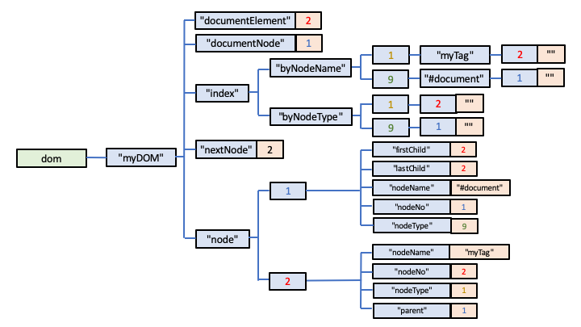

# Implementing an XML Database or Persistent Document Object Model using Globals

## Native XML Databases and the Document Object Model

Some years ago, one of the interesting categories of NoSQL databases was the so-called 
[Native XML Database](http://www.rpbourret.com/xml/XMLAndDatabases.htm).  With the demise of XML and the rise of JSON, XML Databases have become less popular, but they are, in fact, a very useful and powerful class of database.  If you think of them more as a database that can persist, maintain and allow you to query any hierarchical data structure (including JSON), and therefore think of them more as a persistent Document Object Model (DOM) than somehow limited to handling XML, then they begin to become very interesting.

Indeed it's interesting and relevant that one of the major players in the Native XML Database marketplace, [MarkLogic](https://www.marklogic.com/product/marklogic-database-overview/), is now positioned as a multi-model database.  How and why is this possible?  Because, as I've noted before, an inherently hierarchical database engine can be used to model any other type of database!

The DOM is, of course, a [W3C standard](https://www.w3.org/DOM/Activity.html), with variants covering both HTML and XML, the former providing the basis for how markup is maintained within browsers.

Querying a DOM is also possible using syntax also standardised by W3C, for example, 
[XPath](https://www.w3.org/TR/xpath/all/) and [XQuery](https://www.w3.org/XML/Query/).

The DOM is usually assumed to be, and normally implemented as an in-memory data structure.  However, there is no reason why it cannot be implemented as a persistent data structure, provided you have a suitable database within which to model it, and, for example, XPath can be then used as a query language for it.

Needless to say, it is very straightforward to implement the DOM using Global Storage.

## Modelling the DOM

The specification for the DOM is interesting because it doesn't actually mandate how its underlying data structures should be physically modelled.  Instead it defines the APIs that constitute a fully-operational DOM.  As such, the DOM is something that is implemented in a language, with the underlying data structures largely irrelevant and hidden from view of the user/developer.  The most familiar DOM implementation for most people is its JavaScript version, which is used to manipulate the HTML content of web pages in browsers.

And so it is for a persistent DOM also.  Our Global-Storage based version which forms part of
the [QEWD-JSdb](https://github.com/robtweed/qewd-jsdb) project is written also using 
JavaScript but is intended to be run server-side in Node.js.

In this document I won't focus on the APIs.  If you want to learn how the QEWD-JSdb DOM APIs are implemented, they are fully documented for various implementations of Global Storage:

- [QEWD-JSdb showcase](https://github.com/robtweed/qewd-jsdb/blob/master/DOM.md)
- [DOM for the Redis implementation of Global Storage](https://github.com/robtweed/qewd-jsdb-kit-redis/blob/master/DOM.md)
- [DOM for the BerkeleyDB Implementation of Global Storage](https://github.com/robtweed/qewd-jsdb-kit-bdb/blob/master/DOM.md)
- [DOM for the YottaDB Implementation of Global Storage](https://github.com/robtweed/qewd-starter-kit-yottadb/blob/master/DOM.md)
- [DOM for the IRIS Implementation of Global Storage](https://github.com/robtweed/qewd-jsdb-kit-iris/blob/master/DOM.md)

Here I'll focus on the underlying Global Storage model used for those implementations.

In QEWD-JSdb you can build and maintain a DOM at and below any Global Storage 
[Intermediate Node](./Global_Nodes.md).  In this document I'll simplify the model by assuming it's built from and below this Intermediate Node:

        dom[document_name]

eg:

        dom["myDOM"]

It's also easiest to describe the DOM's data structure with reference to HTML or XML, but, as I mentioned before, you shouldn't believe that a persistent DOM should be limited to the storage of HTML or XML.

## DOM Nodes

The DOM is based around the idea of breaking down each XML tag into its fundamental building blocks, and then describing the hierarchical relationship between them.

In the DOM, the unit that forms the fundamental building block is known as a *Node*.  The DOM defines a number of different *Node Type*s, eg:

- the notional top node of an XML document, known as the Document Element
- tags, or, in DOM terminology, Elements
- attributes
- text
- comments
- processing instructions
- CDATA Sections
- ...etc

Depending on the Node Type, a Node can have a number of properties, eg:

- nodeName
- value

The relationships between Nodes is described using:

- peer pointers (eg *nextSibling* and *previousSibling*)
- child/parent pointers (eg *parentNode*, *firstChild*, *lastChild*)

That's pretty much the basics of the DOM, and the DOM APIs are designed to manipulate these building blocks, and, in so doing, allow you to manipulate an HTML or XML document.

## Global Storage Data Model

### Starting Point: the Document Node

The starting point for the Global Storage model of the DOM is the Document Node which is a notional top-level Node, below which the rest of the XML or HTML document tree of sub-nodes is built.  In the DOM specification, a Document Node has a Node Type of *9* and a notional/nominal name of *#document*.

In common with the other database models described so far, each Node, when instantiated, is given an otherwise meaningless *node_id*, issued by incrementing an integer value held in a counter node.  So here's the structure for a newly-instantiated DOM that otherwise doesn't yet contain any data:

        dom[document_name, "documentNode"] = 1
        dom[document_name, "nextNodeNo"] = 1
        dom[document_name, "node", 1, "nodeName"] = "#document"
        dom[document_name, "node", 1, "nodeNo"] = 1
        dom[document_name, "node", 1, "nodeType"] = 9

It's important to also provide some indexing to allow efficient traversal of the DOM's Nodes by the various APIs, so the Global Storage model also includes a "by node name" and "by node type" index:

        dom[document_name, "index", "by_nodeName", 1, "myTag", 2]=""
        dom[document_name, "index", "by_nodeName", 9, "#document", 1]=""

Now let's see how the model extends when we add a top level XML element into the Document, eg:

        <myTag />

Elements have a Node Type of *1*, and *myTag* is defined as the Node's *NodeName* property.

It will be allocated the next id:

        INCREMENT dom[document_name, "nextNodeNo"]  // returns 2

and the tag will be represented as:

        dom[document_name, "index", "by_nodeName", 1, "myTag",2] = ""
        dom[document_name, "index", "by_nodeType", 1, 2] = ""
        dom[document_name, "node", 2, "nodeName"] = "myTag"
        dom[document_name, "node", 2, "nodeNo"] = 2
        dom[document_name, "node", 2, "nodeType"] = 1

The Element then needs to be appended to the Document Node, which is represented by the following additional Global Nodes

        dom[document_name, "node", 1, "firstChild"] = 2
        dom[document_name, "node", 1, "lastChild"] = 2
        dom[document_name, "node", 2, "parent"] = 1

The DOM refers to the Element at the top of the DOM as the *Document Element*, so this is represented:

        dom[document_name, "documentElement"] = 2

Diagrammatically, then, our single-element XML document would look like this in Global Storage:

Further extending the example, adding a child Element with an attribute, eg:

        <myTag>
          <foo hello="world" />
        </myTag>

Attributes are also represented as a Node in the DOM (Node Type = 2), so in Global Storage this new node (allocated a node id of 3) and its attribute (allocated a node id of 4), are represented as:

        dom["myDOM", "index", "by_nodeName", 1, "foo", 3] = ""
        dom["myDOM", "index", "by_nodeName", 2, "hello", 4] = ""
        dom["myDOM", "index", "by_nodeType", 1, 3] = ""
        dom["myDOM", "index", "by_nodeType", 2, 4] = ""
        dom["myDOM", "node", 3, "attr", "hello"] = 4
        dom["myDOM", "node", 3, "nodeName"] = "foo"
        dom["myDOM", "node", 3, "nodeNo"] = 3
        dom["myDOM", "node", 3, "nodeType"] = 1
        dom["myDOM", "node", 4, "nodeName"] = "hello"
        dom["myDOM", "node", 4, "nodeNo"] = 4
        dom["myDOM", "node", 4, "nodeType"] = 2
        dom["myDOM", "node", 4, "nodeValue"] = "world"
        dom["myDOM", "node", 4, "parent"] = 3

and parent/child pointers are added to connect the new *foo* Element (node id 3) to the *myTag* Document Element (node id 2):

        dom["myDOM", "node", 2, "firstChild"] = 3
        dom["myDOM", "node", 2, "lastChild"] = 3
        dom["myDOM", "node", 3, "parent"] = 2

Next, let's see what happens if the *foo* Element also has a text value, eg:

        <myTag>
          <foo hello="world">Some text</foo>
        </myTag>

The DOM represents text as a Node (type = 3), so it's added (with an allocated node id of 5) as:

        dom["myDOM", "index", "by_nodeName", 3, "#text", 5] = ""
        dom["myDOM", "index", "by_nodeType", 3, 5] = ""
        dom["myDOM", "node", 5, "nodeName"] = "#text"
        dom["myDOM", "node", 5, "nodeNo"] = 5
        dom["myDOM", "node", 5, "nodeType"] = 3
        dom["myDOM", "node", 5, "nodeValue"] = "Some text"
        dom["myDOM", "node", 5, "parent"] = 3

and its Element (*foo*) is linked to it:

        dom["myDOM", "node", 3, "firstChild"] = 5
        dom["myDOM", "node", 3, "lastChild"] = 5

Finally, let's change the XML document so that it includes some sibling Elements before and after the *foo* element, ie:

        <myTag>
          <bar1 />
          <foo hello="world">Some text</foo>
          <bar2>
        </myTag>

If we start the DOM building again from scratch, this new document would now be represented in Global Storage thus:

        dom["myDOM", "documentElement"] = 2
        dom["myDOM", "documentNode"] = 1
        dom["myDOM", "index", "by_nodeName", 1, "bar1", 3] = ""
        dom["myDOM", "index", "by_nodeName", 1, "bar2", 7] = ""
        dom["myDOM", "index", "by_nodeName", 1, "foo", 4] = ""
        dom["myDOM", "index", "by_nodeName", 1, "myTag", 2] = ""
        dom["myDOM", "index", "by_nodeName", 2, "hello", 5] = ""
        dom["myDOM", "index", "by_nodeName", 3, "#text", 6] = ""
        dom["myDOM", "index", "by_nodeName", 9, "#document", 1] = ""
        dom["myDOM", "index", "by_nodeType", 1, 2] = ""
        dom["myDOM", "index", "by_nodeType", 1, 3] = ""
        dom["myDOM", "index", "by_nodeType", 1, 4] = ""
        dom["myDOM", "index", "by_nodeType", 1, 7] = ""
        dom["myDOM", "index", "by_nodeType", 2, 5] = ""
        dom["myDOM", "index", "by_nodeType", 3, 6] = ""
        dom["myDOM", "index", "by_nodeType", 9, 1] = ""
        dom["myDOM", "nextNodeNo"] = 7
        dom["myDOM", "node", 1, "firstChild"] = 2
        dom["myDOM", "node", 1, "lastChild"] = 2
        dom["myDOM", "node", 1, "nodeName"] = "#document"
        dom["myDOM", "node", 1, "nodeNo"] = 1
        dom["myDOM", "node", 1, "nodeType"] = 9
        dom["myDOM", "node", 2, "firstChild"] = 3
        dom["myDOM", "node", 2, "lastChild"] = 7
        dom["myDOM", "node", 2, "nodeName"] = "myTag"
        dom["myDOM", "node", 2, "nodeNo"] = 2
        dom["myDOM", "node", 2, "nodeType"] = 1
        dom["myDOM", "node", 2, "parent"] = 1
        dom["myDOM", "node", 3, "nextSibling"] = 4
        dom["myDOM", "node", 3, "nodeName"] = "bar1"
        dom["myDOM", "node", 3, "nodeNo"] = 3
        dom["myDOM", "node", 3, "nodeType"] = 1
        dom["myDOM", "node", 3, "parent"] = 2
        dom["myDOM", "node", 4, "attr", "hello"] = 5
        dom["myDOM", "node", 4, "firstChild"] = 6
        dom["myDOM", "node", 4, "lastChild"] = 6
        dom["myDOM", "node", 4, "nextSibling"] = 7
        dom["myDOM", "node", 4, "nodeName"] = "foo"
        dom["myDOM", "node", 4, "nodeNo"] = 4
        dom["myDOM", "node", 4, "nodeType"] = 1
        dom["myDOM", "node", 4, "parent"] = 2
        dom["myDOM", "node", 4, "previousSibling"] = 3
        dom["myDOM", "node", 5, "nodeName"] = "hello"
        dom["myDOM", "node", 5, "nodeNo"] = 5
        dom["myDOM", "node", 5, "nodeType"] = 2
        dom["myDOM", "node", 5, "nodeValue"] = "world"
        dom["myDOM", "node", 5, "parent"] = 4
        dom["myDOM", "node", 6, "nodeName"] = "#text"
        dom["myDOM", "node", 6, "nodeNo"] = 6
        dom["myDOM", "node", 6, "nodeType"] = 3
        dom["myDOM", "node", 6, "nodeValue"] = "Some text"
        dom["myDOM", "node", 6, "parent"] = 4
        dom["myDOM", "node", 7, "nodeName"] = "bar2"
        dom["myDOM", "node", 7, "nodeNo"] = 7
        dom["myDOM", "node", 7, "nodeType"] = 1
        dom["myDOM", "node", 7, "parent"] = 2
        dom["myDOM", "node", 7, "previousSibling"] = 4

This time, the *bar1* tag is represented as node id 3:

        dom["myDOM", "node", 3, "nextSibling"] = 4
        dom["myDOM", "node", 3, "nodeName"] = "bar1"
        dom["myDOM", "node", 3, "nodeNo"] = 3
        dom["myDOM", "node", 3, "nodeType"] = 1
        dom["myDOM", "node", 3, "parent"] = 2

Its parent is node 2 which is the *myTag* Element.  It does not have any child elements, doesn't have a previous sibling node, but its next sibling is node 4 which is the *foo* tag:

        dom["myDOM", "node", 4, "firstChild"] = 6
        dom["myDOM", "node", 4, "lastChild"] = 6
        dom["myDOM", "node", 4, "nextSibling"] = 7
        dom["myDOM", "node", 4, "nodeName"] = "foo"
        dom["myDOM", "node", 4, "nodeNo"] = 4
        dom["myDOM", "node", 4, "nodeType"] = 1
        dom["myDOM", "node", 4, "parent"] = 2
        dom["myDOM", "node", 4, "previousSibling"] = 3

So the *foo* tag's one and only child Node is its text node (6).  Its parent Node is also the *myTag* Element (node 2), but it has a next sibling (node 7) which is the *bar2* Element, and its previous Sibling (node 3) is the *bar1* Element.

Looking at the *bar2* Element:

        dom["myDOM", "node", 7, "nodeName"] = "bar2"
        dom["myDOM", "node", 7, "nodeNo"] = 7
        dom["myDOM", "node", 7, "nodeType"] = 1
        dom["myDOM", "node", 7, "parent"] = 2
        dom["myDOM", "node", 7, "previousSibling"] = 4

we see that, once again, its parent node (2) is the *myTag* Element.  It has no next sibling node, but its previous sibling (node 7) is the *foo* Element.

Looking at the *myTag* Element:

        dom["myDOM", "node", 2, "firstChild"] = 3
        dom["myDOM", "node", 2, "lastChild"] = 7
        dom["myDOM", "node", 2, "nodeName"] = "myTag"
        dom["myDOM", "node", 2, "nodeNo"] = 2
        dom["myDOM", "node", 2, "nodeType"] = 1
        dom["myDOM", "node", 2, "parent"] = 1

we see that its first child node (3) is the *bar1* Element and its last child node (7) is the *bar2* Element.

You can probably see that most of the Global Nodes that are used to represent the DOM are pointers to other Global Nodes.  The DOM can actually be considered to be a type of [graph database](./Graph.md), with *nodes* representing the core building-block XML DOM Nodes, and *edges* representing the links between them.

You can also see that an XML document ends up being represented by a very large number of Global Nodes, but the sparse nature of Global Storage makes this very efficient and really nothing to be concerned about.

## Traversing and manipulating a DOM

To output a DOM as its original XML representation, it's simply a matter of recursively following the *firstChild* and *nextSibling* pointers in the Global Storage, and then representing the Nodes they point to appropriately for the Node Type it represents.

With Global Storage, you could, of course, start this recursive process anywhere within the DOM, so you could, if you wanted, just output a sub-section of the document.

You also have access to every individual Node representing the original document, and you can then use the DOM APIs to manipulate some or all of the Nodes in the Document.  So, for example, you can insert or remove elements, modify attributes and text anywhere in the document, and you can even move sub-sections of the XML document around within the document.

Finally, the XPath query language is usually implemented using the DOM APIs, so, provided the DOM APIs that work against the Global Storage conform to the W3C standard, any XPath implementation should automatically work with a DOM that is held in Global Storage rather than in-memory.  You'll find that the *QEWD-JSdb* implementation is therefore able to use a standard "off the shelf" Node.js XPath module and it "just works"!

 

